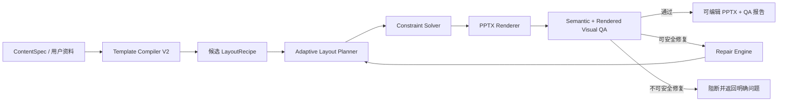
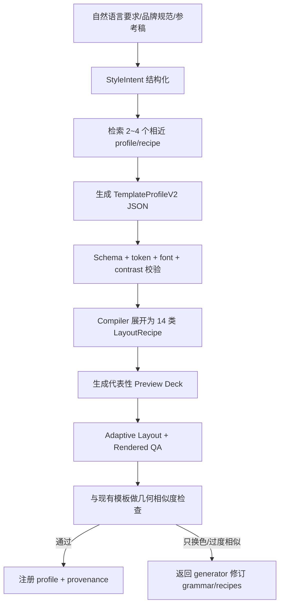

# PPTX Skill 三大能力升级：完整实现设计

> 状态：Implementation-ready design
>
> 日期：2026-07-18
>
> 范围：真正的视觉 QA、约束式自适应排版、生成式模板引擎 V2
>
> 目标读者：负责实现和验收当前 PPTX Skill 的工程师或 Agent

## 0. 执行摘要

当前 Skill 已经具备生成、编辑、参考稿复用、备份、渲染和基础验收能力，但三个核心模块仍是启发式实现：

1. `auto_validate_ppt()` 只能检查结构统计，不能可靠发现溢出、遮挡、错误裁图和视觉回归。
2. `choose_layout()` 根据字段是否存在选择固定版式，不会根据真实文本尺寸和内容密度重新求解布局。
3. `template_engine.py` 通过关键词选择基模板和几何家族，再生成配色；不会生成新的设计语法和版式骨架。

升级后的主链路应为：



关键工程决策：

- 使用“离散候选枚举 + Kiwi 线性约束求解”，而不是让 LLM 直接输出任意坐标。
- 使用结构检查、字体度量、渲染图像分析和视觉回归四层 QA，不能只依赖像素差或 XML。
- 模板生成输出受 JSON Schema/Pydantic 约束的声明式 `TemplateProfileV2`，不允许生成并执行任意 Python 代码。
- 保留现有 `pptx_helper.py` 作为兼容入口，通过 `layout_engine="legacy|adaptive"` 渐进迁移。
- 自动修复最多两轮，且每一步必须写入 manifest；不允许无限重试或不可追踪的视觉漂移。

## 1. 范围与非目标

### 1.1 本次必须完成

- 检测文字溢出、元素越界、非预期重叠、低对比度、图片拉伸、主体裁切和视觉回归。
- 根据真实字体、画幅、内容长度和图片比例生成多个候选布局并选择最优解。
- 支持内容超载时自动缩排、换候选版式或拆页，而不是无底线缩小字体。
- 从风格意图生成设计 token、网格、布局 recipe、页面节奏和 QA 约束。
- 支持 16:9、4:3、竖版和自定义画幅。
- 保持最终 `.pptx` 可编辑，并兼容现有 manifest、参考稿 `native/clone` 路径和页面编辑接口。
- 提供单元测试、属性测试、黄金渲染测试、跨引擎测试和性能基准。

### 1.2 本次不承诺

- 完整保留或生成 PowerPoint 动画、宏、OLE、复杂 SmartArt。
- 在 LibreOffice 与 PowerPoint 之间实现逐像素一致；不同渲染引擎必须使用不同基线。
- 从扁平截图恢复原始矢量、不可见数据和原动画。
- 让模型直接生成未经验证的 OOXML、Python 或 JavaScript 并执行。
- 用一个端到端黑盒模型替换可解释、可测试的排版和验收逻辑。

## 2. 当前基线与具体缺口

| 模块 | 当前实现 | 直接缺口 | V2 落点 |
|---|---|---|---|
| 版式选择 | `pptx_helper.choose_layout()` 按字段判断 | 不理解内容密度，不测量文本 | `layout_engine.plan_slide()` |
| 几何生成 | 14 个固定 layout 函数 + 3 个家族变体 | 坐标固定，无法求解或自动拆页 | 声明式 `LayoutRecipe` + Kiwi |
| 文字适配 | 固定字号和文本框尺寸 | 长文本溢出，中英文差异未处理 | `text_metrics.py` + fit policy |
| 图片适配 | `_fit_image_in_box()` 通过扩大图片模拟 cover | 可能覆盖相邻区域，没有真正设置 crop | `image_crop.py` 写入 crop fractions |
| 模板生成 | 关键词选基模板/家族 + 哈希调色 | 主要仍是换色和选三种骨架 | `TemplateProfileV2` 编译器 |
| 页面节奏 | V1 catalog 保存并校验 `preferred_sequence` | `auto_generate_ppt()` 尚未消费该字段，当前不会影响实际选版 | `plan_deck_layouts()` 将其编译为跨页偏好和惩罚 |
| 结构验收 | shape 数量、字符数、字号比、颜色数 | 高误报/漏报，不能发现真实视觉问题 | `visual_qa.py` 分层检查 |
| 渲染验收 | 能渲染 PNG，要求 Agent 逐页查看 | 没有机器可读的 rendered QA | `render_qa.py` + 标注图 |
| 测试 | 8 项功能测试 | 没有黄金图、压力测试、跨画幅测试 | `tests/golden` + fixtures |

现有入口不要删除：

- `auto_generate_ppt()` 继续作为对外主 API。
- `auto_validate_ppt()` 先改为调用新 QA，并保留旧返回字段。
- `template_engine.py` 继续支持当前 V1 profile，并增加迁移器。
- `reference_ppt.py` 的 clone/native 逻辑继续使用；自动排版主要用于新建、visual-rebuild 和明确允许重排的页面。

## 3. GitHub 调研结论

没有一个成熟仓库能直接提供“PowerPoint 可编辑对象 + 自适应排版 + 视觉 QA”的完整方案。可行路线是组合以下经过验证的构件，并在当前 Python 架构内实现统一数据模型。

| 项目 | 可借鉴能力 | 许可证 | 本项目采用方式 |
|---|---|---|---|
| [python-pptx](https://github.com/scanny/python-pptx) | `TextFrame.fit_text()`、`TextFitter`、OOXML 对象模型 | MIT | 直接依赖；复用字体查找和 fit 思路，补齐 CJK/富文本 |
| [Pillow](https://github.com/python-pillow/Pillow) | `getlength()`、`getbbox()`、`textbbox()` 与可选 RAQM shaping | MIT-CMU | 作为主字体度量后端，缓存真实字体测量结果 |
| [PptxGenJS](https://github.com/gitbrent/PptxGenJS) | text fit 标记、表格自动分页、母版和对象 API | MIT | 借鉴分页策略；不引入 Node 运行时 |
| [Kiwi](https://github.com/nucleic/kiwi) | 高性能 Cassowary 线性约束求解器和 Python bindings | BSD-3-Clause | 作为 adaptive layout 的核心可选依赖 |
| [Shapely](https://github.com/shapely/shapely) | 旋转矩形/多边形相交、空间索引 | BSD-3-Clause | 可选 geometry extra；处理旋转对象和复杂 freeform |
| [Pixelmatch](https://github.com/mapbox/pixelmatch) | 抗锯齿感知、感知色差、窗口化像素差密度 | ISC | 借鉴 rendered diff 算法；Python 内实现或可选调用 |
| [scikit-image](https://github.com/scikit-image/scikit-image) | SSIM 等图像质量度量 | BSD-3-Clause | 可选 QA extra，用于视觉回归和参考稿相似度 |
| [smartcrop.js](https://github.com/jwagner/smartcrop.js) | 边缘、肤色、饱和度、候选窗口评分和 boost 区域 | MIT | 将算法思想实现为 Python smart crop；可选人脸 boost |
| [Presenton](https://github.com/presenton/presenton) | 组件化模板、Pydantic/JSON Schema、布局预览工具、LLM 结构化输出 | Apache-2.0 | 借鉴 schema/preview/validation 架构，不复制其前端运行时 |
| [PPTAgent](https://github.com/icip-cas/PPTAgent) | 从参考演示文稿归纳设计、内容 schema 与布局匹配 | MIT | 借鉴“设计归纳 → 内容结构 → 布局匹配”阶段划分 |
| [Style Dictionary](https://github.com/style-dictionary/style-dictionary) | 分层 design token、转换和多目标输出 | Apache-2.0 | 借鉴 primitive/semantic/component token 分层，不引入其 Node 构建链 |
| [Slidev](https://github.com/slidevjs/slidev) | 可共享主题、命名 layout、内容与设计分离 | MIT | 借鉴主题包和 layout 命名机制 |
| [Marp Core](https://github.com/marp-team/marp-core) | 主题元数据、画幅预设、受控 auto-scaling | MIT | 借鉴 canvas preset 与主题声明方式 |

需要特别吸收的实现事实：

- `python-pptx` 已经使用 Pillow 字体度量和二分搜索寻找最大可用字号，但其现有换行器主要按空格分词，不足以直接覆盖中文、日文和富文本。
- Pillow 可以提供真实字体 advance/bbox；启用 RAQM 时可改善复杂脚本 shaping，但 PowerPoint 与 Pillow 仍可能存在字距差异，必须保留安全余量和 rendered confirmation。
- PptxGenJS 的 `fit: "shrink"`/`"resize"` 依赖 PowerPoint 打开或编辑后触发，不适合作为生成时验收；当前 Skill 必须在写文件前自己求出最终字号。
- PptxGenJS 的表格分页将“估算行高 → 计算可用高度 → 自动新页”拆成独立流程，这个思想可推广到 bullets、时间线和图片列表。
- Presenton V2 将 content/decorative 元素、min/max 字数、容器/flex/grid 和预览验证写进 schema；这是模板可生成、可编辑和可验证的关键。
- 当前 V1 的 `preferred_sequence` 只被保存和合法性校验，没有进入 `auto_generate_ppt()` 的页面规划；V2 必须用端到端测试证明该配置真正改变候选序列。
- Pixelmatch 的窗口化差异密度可减少渲染抗锯齿造成的散点噪声；单纯计算全图不同像素占比不够稳定。

许可证要求：如果直接移植任何第三方代码，必须保留相应版权和许可证文本；优先重新实现算法接口并在 `THIRD_PARTY_NOTICES.md` 记录来源。

## 4. 目标架构

### 4.1 模块边界

```text
scripts/
├── pptx_helper.py              # 兼容 facade；不再承载全部实现
├── content_model.py            # ContentSpec / SlideSpec / ElementSpec
├── design_schema.py            # TemplateProfileV2 / LayoutRecipe / tokens
├── template_compiler.py        # StyleIntent -> ProfileV2 -> recipes
├── layout_engine.py            # 候选生成、求解、评分、整本节奏
├── text_metrics.py             # 字体解析、换行、字号拟合、拆页估算
├── image_crop.py               # contain/cover/smart crop + crop fractions
├── visual_qa.py                # PPTX 语义检查与统一 QAReport
├── render_qa.py                # PNG 分析、SSIM、pixel diff、标注图
├── repair_engine.py            # 安全修复动作和重试预算
├── render_slides.py            # 保持现有渲染入口
├── template_engine.py          # CLI facade；兼容 V1，转发 V2
└── ...                         # 现有编辑、参考稿、项目文件

assets/templates/
├── catalog.json                # 现有 V1
└── v2/
    ├── catalog.json
    ├── schema.json
    └── *.json

tests/
├── fixtures/
│   ├── content/
│   ├── references/
│   ├── fonts/
│   └── annotated_qa/
├── golden/
│   ├── libreoffice/
│   └── powerpoint/
├── test_text_metrics.py
├── test_layout_engine.py
├── test_visual_qa.py
├── test_render_qa.py
├── test_template_v2.py
└── test_end_to_end_adaptive.py
```

### 4.2 依赖方向

```text
content_model      design_schema
       \              /
        template_compiler
                |
 text_metrics -> layout_engine <- image_crop
                |
           pptx_helper
                |
          visual_qa -> render_qa
                |
          repair_engine
```

约束：

- `content_model.py` 和 `design_schema.py` 不得 import `python-pptx`。
- `pptx_helper.py` 只作为 facade 和 renderer adapter，不反向被底层模型 import。
- `visual_qa.py` 可以读取 PPTX 和 manifest，但不得调用生成入口，避免循环依赖。
- `repair_engine.py` 只产生 `RepairAction`，由 orchestration 层应用后重新生成。

## 5. 统一数据契约

### 5.1 坐标系统

内部统一使用 point：

- 1 inch = 72 pt。
- 16:9 默认画布约为 `959.976 × 540 pt`。
- 字号本身也是 point，便于约束求解和文字度量。
- 写入 PPTX 时统一转换为 EMU；渲染 QA 时按实际 PNG 尺寸转换为 pixel。
- Profile 中允许使用相对单位，但必须在 compiler 阶段转换为 point。

不要在新模块中混用英寸、EMU、像素和 0~1 归一化坐标。

### 5.2 核心模型

```python
@dataclass(frozen=True)
class CanvasSpec:
    width_pt: float
    height_pt: float
    name: str = "16:9"

@dataclass(frozen=True)
class BBox:
    x: float
    y: float
    width: float
    height: float

@dataclass
class ElementSpec:
    id: str
    kind: Literal["text", "image", "shape", "table", "chart", "group"]
    role: str
    content: dict
    style_ref: str
    constraints: list[dict]
    decorative: bool = False

@dataclass
class SlideSpec:
    id: str
    role: str
    communication_goal: str
    elements: list[ElementSpec]
    preferred_layouts: list[str]
    source_section_index: int | None = None

@dataclass
class LayoutPlan:
    canvas: CanvasSpec
    recipe_id: str
    boxes: dict[str, BBox]
    resolved_styles: dict[str, dict]
    score: float
    diagnostics: list[dict]
```

### 5.3 QA 结果模型

```python
class Severity(str, Enum):
    INFO = "info"
    WARNING = "warning"
    BLOCKER = "blocker"

class CheckOutcome(str, Enum):
    PASS = "pass"
    FAIL = "fail"
    INCONCLUSIVE = "inconclusive"

@dataclass
class QAIssue:
    code: str
    severity: Severity
    outcome: CheckOutcome
    slide_index: int
    shape_id: int | None
    bbox: BBox | None
    message: str
    evidence: dict
    suggested_repairs: list[str]
    confidence: float

@dataclass
class QAReport:
    passed: bool
    renderer: str | None
    issues: list[QAIssue]
    metrics: dict
    artifacts: dict
```

所有 CLI 输出都支持 `--json`，终端文本只是展示层。

`Severity` 表示影响，`CheckOutcome` 表示检测结论。复杂图片背景、透明叠加、缺少字体或渲染后端时不得强行给出二元结论，应输出 `inconclusive`、置信度和缺失证据；strict 模式可按 profile 决定是否将 inconclusive 升格为 blocker。

## 6. 能力一：真正的视觉 QA

### 6.1 分层检查

QA 必须按以下顺序执行：

1. Package preflight：文件能否打开、关系是否完整、媒体是否丢失。
2. Semantic geometry：对象边界、文字容量、颜色、字体和 crop 信息。
3. Rendered image：实际渲染结果中的空白、边缘裁切、视觉差异和异常区域。
4. Deck-level：页面节奏、重复构图、样式漂移和跨页一致性。

前一层出现 package blocker 时，不继续执行依赖渲染的检查。

### 6.2 检查项与算法

| Issue code | 检查 | 算法 | 默认修复 |
|---|---|---|---|
| `SHAPE_OUT_OF_BOUNDS` | 对象超出画布/安全区 | BBox 与 canvas/safe-margin 相交 | 移回 zone 或换候选布局 |
| `UNINTENDED_OVERLAP` | 非预期重叠 | 矩形交集率 + z-order + role allowlist | solver 重新求解 |
| `TEXT_OVERFLOW_ESTIMATED` | 结构层推测文字容量不足 | 字体真实度量 + 换行 + 最小字号检查 | fit、扩区、换布局或拆页 |
| `TEXT_OVERFLOW_CONFIRMED` | 渲染后确认裁字/遮挡 | rendered text region、边缘/OCR 高置信证据 | 阻断并重新排版 |
| `FONT_MISSING` | 字体不可用/回退 | FontResolver 与本机字体表比对 | 使用 profile fallback |
| `LOW_CONTRAST` | 文本与背景对比不足 | 纯色计算；图片背景局部采样 | 改文字色或加受控底层 |
| `IMAGE_DISTORTED` | 图片比例被拉伸 | 原图比例与 shape/crop 后比例比对 | 改为 crop/contain |
| `IMAGE_SUBJECT_CROPPED` | 主体落在 crop 外 | saliency/face boost 的保留率 | 调整 focus point |
| `IMAGE_LOW_RESOLUTION` | 投影清晰度不足 | 有效像素 ÷ 显示尺寸/DPI | 换图或降低显示面积 |
| `EMPTY_PLACEHOLDER` | 遗留占位符 | placeholder + 空内容/模板文本 | 删除或填充 |
| `VISUAL_REGRESSION` | 与基线/参考稿差异过大 | pixel diff density + SSIM | 阻断，要求定位差异 |
| `LAYOUT_REPETITION` | 相邻构图过度重复 | geometry signature 相似度 | deck planner 换 variant |
| `STYLE_DRIFT` | 字体/色彩/页脚漂移 | token 使用率和位置聚类 | 重放 profile tokens |

### 6.3 重叠检测

对每页非 background 对象构造几何区域。对象数通常低于 100，轴对齐对象第一版直接使用 BBox 与 `O(n²)`，不必引入空间索引依赖。对象存在 rotation、freeform 或非矩形裁切时，使用 Shapely polygon 相交；若 optional geometry extra 缺失，则标记 `geometry_approximation=true`，对可能受影响的结论返回 inconclusive，而不是把包围盒误判成真实重叠。超过 200 个对象或批量处理时再启用 `STRtree`。

```text
intersection_ratio = intersection_area / min(area_a, area_b)
```

只有以下情况默认允许重叠：

- 标为 `decorative=true` 的背景、分隔线、遮罩。
- 文本与其声明的容器/背景形状。
- 图片与 overlay 文本，且 recipe 明确设置 `allow_overlap`。
- group 内部由 recipe 声明的叠放关系。

不能通过“形状类型相同”推断允许重叠。所有例外都应来源于 recipe 或 manifest 中的语义标签。

初始阈值建议：

- 交集率 `< 0.01`：忽略浮点/阴影边缘误差。
- `0.01 ~ 0.05`：warning。
- `> 0.05` 且不在 allowlist：blocker。

阈值必须通过标注 fixture 校准，不作为永恒常量。

### 6.4 文字溢出检测

不要只用字符数估算。实现 `TextMeasurer`：

```python
class TextMeasurer(Protocol):
    def measure(
        self,
        runs: list[TextRun],
        width_pt: float,
        paragraph_style: ParagraphStyle,
        font_size_pt: float,
        locale: str,
    ) -> TextMetrics: ...
```

步骤：

1. `FontResolver` 将字体家族、粗细、斜体解析为真实字体文件。
2. 使用 Pillow `getlength/getbbox/textbbox` 测量；环境支持时启用 RAQM，复杂脚本可再使用 HarfBuzz fallback。
3. 以 run 为单位测量，保留粗体、字号和中英文混排差异。富文本拟合只二分搜索一个全局 scale factor，各 run 的相对字号、基线和强调关系保持不变，不得扁平化成单一字体。
4. 拉丁文字按单词断行；CJK 按 grapheme/字符断行，并实现行首行尾禁则。
5. 计算行宽、总高度、段前后间距、项目符号缩进和文本框内边距，并预留 3%~5% renderer safety margin。
6. 对字号/全局 scale 做二分搜索，得到 `required_font_size`。
7. 若 `required_font_size < style.min_font_size`，不是继续缩小，而是请求重新排版或拆页。
8. 缓存 `(font_file, weight, size, text, features, language, width)` 的测量结果；字体文件 mtime 或版本改变时失效。

`python-pptx.TextFrame.fit_text()` 可作为单一字体、简单文本的快速路径；富文本和 CJK 必须走自定义 measurer。结构层只能产出 `TEXT_OVERFLOW_ESTIMATED`；blocker 级 `TEXT_OVERFLOW_CONFIRMED` 应由渲染结果、PowerPoint 实际输出或高置信 OCR/边缘证据确认。OCR 仅作为 optional corroboration，低置信度时不得自动判定失败。

### 6.5 对比度检测

- 纯色背景：计算文本色与背景色的相对亮度和对比比。
- 渐变/图片背景：将文本 BBox 映射到渲染 PNG，采样九宫格或文字 mask 周围像素，使用最低分位数而非均值。
- 大号文字和普通文字使用不同阈值；阈值写入 profile 的 `qa.contrast`。
- 结果必须是 `pass/fail/inconclusive`；不确定背景、复杂透明叠加或无法获得 rendered pixels 时返回 warning + confidence，而不是假装精确。
- 只有纯色背景或高置信 rendered sampling 才允许自动修复颜色；否则建议增加受控底板或交给人工确认。

### 6.6 图片裁切和主体保护

第一版将 smart crop 实现为纯 Python：

1. 缩小到最长边 256~512 px。
2. 计算 Laplacian/边缘、饱和度和肤色近似图。
3. 可选使用 OpenCV 人脸检测产生 boost boxes。
4. 按目标宽高比生成候选 crop window。
5. 对候选窗口计算细节、中心权重、三分法和边缘惩罚。
6. 返回 focus point 和 crop rect。
7. 在 PPTX picture shape 上写入真实 `crop_left/right/top/bottom`，禁止通过放大 picture 越出目标框模拟 crop。

QA 记录：

```json
{
  "saliency_retained": 0.93,
  "face_retained": 1.0,
  "crop_fraction": 0.28,
  "focus": [0.62, 0.41]
}
```

### 6.7 渲染视觉回归

同一渲染引擎内同时计算：

- 感知像素差：忽略抗锯齿，输出 diff mask。
- 窗口化差异密度：捕获局部真实回归，降低散点噪声。
- SSIM：检测大区域结构变化。
- 边缘差：对文字、线条和布局移动更敏感。

不同渲染引擎不能共用同一黄金图。目录按以下方式隔离：

```text
tests/golden/libreoffice/<version>/<font-pack>/...
tests/golden/powerpoint/<version>/<font-pack>/...
```

baseline key 至少包含 `renderer + renderer_version + OS + font_pack + target_dpi + actual_pixel_size + color_space + PNG_encoder_version`。每次运行都把这些字段写入 `qa.json`；任一关键字段变化时不得直接与旧基线比较。

当前 `render_with_com(pptx_path, output_dir, dpi)` 接收 `dpi`，但 `Presentations.Export(..., "PNG")` 没有使用该参数。视觉回归上线前必须先修复：按 slide 宽高和目标 DPI 计算 PowerPoint 导出像素尺寸，或在比较前统一无损归一化；同时始终记录实际 PNG 宽高。否则所谓同引擎黄金图仍会因机器默认导出尺寸产生假差异。

建议初始阈值，仅用于建立 fixture 后校准：

```yaml
same_engine:
  perceptual_threshold: 0.10
  max_window_diff_density: 0.015
  min_ssim: 0.985
reference_clone:
  max_window_diff_density: 0.08
  min_ssim: 0.94
```

参考稿 clone 比较应支持忽略明确替换的内容区域，仅比较结构、品牌元素和未映射区域。

### 6.8 输出物

每次 strict QA 产生：

```text
output/report.qa.json
output/report.qa.md
output/report-preview/slide_001.png
output/report-preview/annotated/slide_001.png
output/report-preview/diff/slide_001.png
```

标注图使用红/橙/蓝分别表示 blocker、warning、info，并在对象旁标注 issue code。

## 7. 能力二：约束式自适应排版

### 7.1 为什么不能只用一个约束求解器

“A 在 B 左边或右边”以及“选择两栏还是上下结构”属于离散决策；Cassowary/Kiwi 主要解决线性连续约束。正确架构是：

1. Recipe 生成若干离散候选拓扑。
2. Kiwi 为每个候选求解 `x/y/w/h` 等连续变量。
3. TextMeasurer、ImageCropper 和 QA 对候选评分。
4. 选择无 blocker 且得分最低的候选。

不要把所有非重叠关系写成难以维护的 if/else，也不要强行把离散决策塞进线性约束。

### 7.2 LayoutRecipe 示例

```json
{
  "id": "editorial.text_image.asymmetric_left",
  "role": "text_image",
  "variant": "asymmetric_left",
  "zones": {
    "title": {"kind": "text", "style": "type.title"},
    "body": {"kind": "text-list", "style": "type.body"},
    "hero": {"kind": "image", "fit": "smart-cover"}
  },
  "constraints": [
    ["title.left", "==", "canvas.safe_left", "required"],
    ["title.top", "==", "canvas.safe_top", "required"],
    ["body.top", ">=", "title.bottom + space.4", "required"],
    ["hero.left", ">=", "body.right + space.6", "strong"],
    ["hero.right", "==", "canvas.safe_right", "required"],
    ["hero.height / hero.width", "~=", "image.aspect", "medium"]
  ],
  "content_limits": {
    "body.max_items": 6,
    "body.min_font_size": 16,
    "title.max_lines": 2
  },
  "fallbacks": [
    "editorial.text_image.stacked",
    "editorial.bullets.wide"
  ]
}
```

实际 schema 不建议直接解析自由字符串表达式。实现时将约束编译为受控 AST，或者使用结构化字段：

```json
{"lhs":"body.top","op":">=","rhs":{"ref":"title.bottom","offset":"space.4"},"strength":"required"}
```

### 7.3 求解流程

```python
def plan_slide(
    slide: SlideSpec,
    profile: TemplateProfileV2,
    canvas: CanvasSpec,
    context: DeckLayoutContext,
) -> LayoutPlan:
    candidates = candidate_generator.generate(slide, profile, context)
    solved = [solve_candidate(c, slide, profile, canvas) for c in candidates]
    feasible = [plan for plan in solved if not plan.has_blocker]
    if not feasible:
        return overflow_policy.split_or_fail(slide, solved)
    return min(feasible, key=lambda plan: plan.score)
```

每个候选至少执行：

1. 根据内容创建变量和初始尺寸。
2. 使用真实字体度量计算文本最小/理想高度。
3. 向 Kiwi 添加 required/strong/medium/weak 约束并求解。
4. 用求解后的实际宽度重新测量文本、更新 `min_h/ideal_h`，重复“求解 → 测量 → 更新约束”2~4 次，直到尺寸变化低于阈值或达到迭代预算。
5. 转换为 BBox，并计算文字 fit、交集、留白、对齐、裁切和重复惩罚。
6. 仅对 `floatable=true` 的标签、注释和数据标记执行局部 collision relaxation；正文、标题和主视觉必须回到 recipe/solver 重算。
7. 生成候选 diagnostics，记录迭代次数、残余误差和 infeasible constraint set。

### 7.4 硬约束与软约束

硬约束：

- 对象不得超出画布和安全区。
- 正文不得小于 profile 规定的最小字号。
- 标题与正文不能发生未声明重叠。
- 图片、表格和图表的宽高必须为正并达到最小可读尺寸。
- Logo、页脚等锁定区域不可被内容占用。

软约束：

- 对齐到网格和 baseline。
- 维持目标留白比例。
- 保持理想图片宽高比。
- 保持标题与正文的理想字号级差。
- 避免相邻页使用相同 geometry signature。
- 尽量不改变模板的主要阅读路径。

### 7.5 候选评分

```text
score =
  1000 * blocker_count
  + 120 * overflow_ratio
  + 100 * unintended_overlap_ratio
  + 70  * out_of_bounds_ratio
  + 25  * crop_subject_loss
  + 20  * density_penalty
  + 12  * alignment_penalty
  + 10  * hierarchy_penalty
  + 8   * adjacent_similarity
  + 4   * deviation_from_recipe
```

权重放入 `LayoutScoringConfig`，通过标注集调参。不要散落在 layout 函数里。

### 7.6 内容超载策略

处理顺序必须固定且可审计：

1. 减少不必要的段前后间距，但不破坏层级。
2. 在允许范围内减小字号。
3. 扩大文本区域，同时收缩次要视觉区域。
4. 切换同角色的高容量候选布局。
5. 将 bullets/table/timeline 按语义边界拆到下一页。
6. 若仍不可行，返回 blocker，要求减少内容或允许更多页。

禁止：

- 正文无条件缩到 10pt 以下。
- 将所有文字压进一个超高密度页面。
- 按字符数机械截断用户内容。
- 拆开不可分割的标题—说明、指标—单位或图表—来源组合。

### 7.7 自动拆页

为可重复内容定义分页器：

```python
def paginate_items(
    items: list[ContentItem],
    capacity_fn: Callable[[list[ContentItem]], FitResult],
    keep_with_next: set[int],
    min_items_per_page: int,
) -> list[list[ContentItem]]: ...
```

支持：

- bullets：尽量 3~7 条/页，保持二级说明和主 bullet 在同页。
- table：重复表头，按实际行高分页。
- timeline：按阶段分组，不拆单一阶段。
- process：优先换成两行或纵向候选，仍不够再分页。
- image grid：根据图片数量选择 2/3/4/6 图布局，避免极小图片。

### 7.8 整本页面节奏

单页最优不等于整本最优。新增：

```python
def plan_deck_layouts(
    slides: list[SlideSpec],
    profile: TemplateProfileV2,
    beam_width: int = 8,
) -> list[LayoutPlan]: ...
```

使用 beam search 或动态规划，对以下项目施加跨页惩罚：

- 相邻 geometry signature 太相似。
- 连续多页密度相同。
- section 前后没有视觉节奏变化。
- dashboard/quote/full-image 等强调页出现过密。
- 封面、章节页和结尾页不属于同一视觉家族。

## 8. 能力三：生成式模板引擎 V2

### 8.1 核心原则

模板生成器只生成“受约束设计系统”，不生成任意绘图代码。最终产物包含：

- design tokens；
- canvas 和 safe area；
- grid/axis/column 等 layout grammar；
- 14 种内容角色的多个 recipe；
- 页面节奏规则；
- 图片和图表风格；
- 内容容量限制；
- QA 阈值和 fallback；
- provenance、schema version 和迁移信息。

Token 使用三层结构，compiler 只允许从上到下引用：

```text
Primitive  原始值：palette.blue.600、font.size.7、space.4
    ↓
Semantic   语义值：color.text.primary、color.surface.raised、space.section
    ↓
Component  组件值：title.color、metric.value.size、table.header.fill
```

这样品牌换色、暗色模式和组件局部覆盖不会直接修改散落的十六进制色值。Layout AST 限定为 `grid/flex/stack/anchor/group/text/image/chart/table/vector/infographic` 等受控节点；节点只能引用 token、内容 slot 和白名单属性，禁止任意代码或任意 OOXML。

### 8.2 TemplateProfileV2

```json
{
  "schema_version": 2,
  "id": "precision-instrument",
  "name": "Precision Instrument",
  "description": "深色、克制、精密仪器感的产品发布模板",
  "canvas": {
    "preset": "16:9",
    "width_pt": 959.976,
    "height_pt": 540,
    "safe_margin": {"top": 38, "right": 52, "bottom": 34, "left": 52}
  },
  "tokens": {
    "color": {
      "background": "#08100F",
      "surface": "#111D1B",
      "text": "#F0F4F2",
      "muted": "#97A8A2",
      "accent": "#47D7AC",
      "signal": "#FFB454"
    },
    "typography": {
      "families": {"display": "Aptos Display", "body": "Microsoft YaHei"},
      "scale": {"hero": 58, "title": 32, "body": 17, "label": 10},
      "min": {"title": 26, "body": 15, "label": 9},
      "line_height": {"title": 1.08, "body": 1.35}
    },
    "spacing": {"unit": 4, "scale": [4, 8, 12, 16, 24, 32, 48, 64]},
    "stroke": {"hairline": 0.75, "regular": 1.25},
    "radius": {"none": 0, "small": 3}
  },
  "grammar": {
    "family": "technical_axis",
    "grid": {"columns": 12, "gutter": 16},
    "primary_axes": ["left", "baseline", "data-axis"],
    "reading_paths": ["f", "column"],
    "whitespace_ratio": {"min": 0.20, "target": 0.28}
  },
  "layouts": {
    "cover": ["precision.cover.axis", "precision.cover.poster"],
    "bullets": ["precision.bullets.rail", "precision.bullets.wide"],
    "text_image": ["precision.text_image.asymmetric_left"],
    "dashboard": ["precision.dashboard.lead_metric", "precision.dashboard.axis"]
  },
  "rhythm": {
    "avoid_adjacent_same_signature": true,
    "emphasis_interval": [3, 5],
    "rules": [
      {"after": "dashboard", "prefer": ["section", "text_image"], "avoid": ["dashboard"]}
    ]
  },
  "qa": {
    "contrast": {"body_min": 4.5, "large_min": 3.0},
    "max_colors_per_slide": 7,
    "min_body_font_size": 15,
    "max_crop_subject_loss": 0.12
  },
  "provenance": {
    "generator": "template-compiler-v2",
    "seed": 184077,
    "source_profiles": ["executive-dark", "data-story"]
  }
}
```

### 8.3 生成管线



### 8.4 StyleIntent

模型或 Agent 首先输出：

```json
{
  "industry": "precision instruments",
  "audience": "board and enterprise buyers",
  "tone": ["precise", "restrained", "technical"],
  "density": "high",
  "image_style": "macro product photography",
  "geometry": ["axes", "hairlines", "asymmetry"],
  "avoid": ["rounded cards", "gradient glow", "decorative circles"],
  "brand_colors": ["#184E77", "#F4A261"],
  "canvas": "16:9",
  "font_constraints": ["must support Simplified Chinese"]
}
```

核心 compiler 不直接依赖某个 LLM SDK。提供接口：

```python
class StyleIntentProvider(Protocol):
    def from_prompt(self, prompt: str, context: dict) -> StyleIntent: ...
```

在 Codex Skill 工作流中，Agent 可以直接生成经 schema 校验的 StyleIntent；CLI 可继续提供确定性的 heuristic provider，或通过显式插件接入模型。这样避免把密钥和供应商 SDK写死在 PPTX 引擎中。

### 8.5 从“选模板”升级为“编译设计语法”

V2 compiler 需要做四类生成：

1. Token synthesis：色彩、字体、字号比例、间距、线宽、圆角和透明度。
2. Grammar selection：网格、轴线、海报列、图像裁切、对齐和阅读路径。
3. Recipe synthesis：为每个 role 组合 zones、约束、内容容量和 fallback。
4. Rhythm planning：定义跨页强调频率、相邻限制和章节转换。

允许使用经过审查的 primitive：

```text
grid, axis, column, stack, split, overlay, rail, full-bleed,
text, text-list, metric, table, chart, image, line, shape, group
```

禁止 profile 携带 Python 表达式、import、任意模板字符串执行或文件路径遍历。

### 8.6 防止“只换颜色”

为每个 recipe 计算 geometry signature：

- 元素 role；
- 归一化 BBox；
- reading order；
- 对齐轴；
- 图文面积比例；
- 密度和留白；
- 主要视觉入口位置。

生成新模板后，与 catalog 中相同 role 的代表页计算最近邻相似度。以下情况拒绝注册：

- 颜色/字体明显变化，但 geometry similarity 高于 0.85。
- 14 个 role 中超过 70% 直接继承同一基模板 recipe，且无参数结构变化。
- cover/section/end 不属于同一 family。
- 页面节奏序列与基模板完全一致，只换 profile 名称。

### 8.7 V1 迁移

```python
def migrate_profile_v1_to_v2(profile: dict) -> TemplateProfileV2:
    # theme -> tokens.color
    # layout_family -> grammar preset
    # layout_opts -> recipe overrides
    # preferred_sequence -> rhythm hints
```

迁移后的 profile 标记：

```json
{"provenance":{"migrated_from":1,"manual_review_required":true}}
```

V1 profile 仍可加载；当调用 adaptive engine 时自动迁移到内存中的 V2，不强制改写用户已有 JSON。

## 9. 三项能力的闭环集成

### 9.1 新 API

```python
auto_generate_ppt(
    title="...",
    sections=sections,
    output_path="output/report.pptx",
    template_key="strategy-consulting",
    layout_engine="adaptive",     # legacy | adaptive
    qa_mode="strict",             # off | report | strict
    max_repair_passes=2,
    canvas="16:9",
    reference_baseline=None,
)
```

返回值长期建议升级为：

```python
GenerationResult(
    pptx_path="...",
    manifest_path="...",
    qa_report_path="...",
    preview_dir="...",
    repair_passes=1,
)
```

为了兼容现有调用，第一阶段仍返回字符串路径，并通过 `return_result=True` 启用结构化返回值。

### 9.2 Orchestrator

```python
for pass_index in range(max_repair_passes + 1):
    plans = plan_deck_layouts(slide_specs, profile)
    pptx_path = render_plans(plans, output_path)
    report = validate_deck(pptx_path, plans=plans, profile=profile)
    if report.passed:
        break
    actions = propose_repairs(report, plans, slide_specs)
    if not actions or pass_index == max_repair_passes:
        raise PresentationQualityError(report)
    slide_specs, profile_overrides = apply_repairs(actions)
```

自动修复只能应用白名单动作：

- `reduce_font_within_limit`
- `expand_zone_within_recipe`
- `switch_layout_candidate`
- `split_repeated_content`
- `adjust_image_focus`
- `change_text_color_to_token`
- `remove_empty_placeholder`

所有修复动作写入 manifest：

```json
{
  "repair_log": [
    {
      "pass": 1,
      "slide": 4,
      "issue": "TEXT_OVERFLOW",
      "action": "switch_layout_candidate",
      "from": "bullets.rail",
      "to": "bullets.wide"
    }
  ]
}
```

### 9.3 参考稿模式策略

| 模式 | Adaptive Layout | 自动修复 |
|---|---|---|
| `native` | 只在占位符内部 fit；不改母版几何 | 字号、换行、图片 crop；必要时阻断 |
| `clone` | 默认关闭几何重排 | 只处理明确映射 shape，其他问题报告 |
| `visual-rebuild` | 完整启用 | 完整启用 |
| 新建模板 | 完整启用 | 完整启用 |

高保真 clone 不能为了消除小重叠而自动改变品牌页结构。

## 10. CLI 设计

```powershell
# 运行严格 QA
python scripts/visual_qa.py deck.pptx `
  --render `
  --engine auto `
  --output output/deck-qa `
  --strict

# 与参考稿或黄金图比较
python scripts/visual_qa.py deck.pptx `
  --reference reference.pptx `
  --mask-plan replacements.json `
  --output output/reference-diff

# 生成 V2 模板
python scripts/template_engine.py generate-v2 `
  --name "Precision Instrument" `
  --intent style-intent.json `
  --brand-color "#184E77" `
  --preview output/precision-preview.pptx `
  --register

# 将 V1 profile 预览为 V2
python scripts/template_engine.py migrate strategy-consulting `
  --preview output/strategy-v2-preview.pptx

# 使用 adaptive engine 生成
python scripts/generate_ppt.py content.json `
  --template precision-instrument `
  --layout-engine adaptive `
  --qa strict `
  --output output/report.pptx
```

所有 CLI：

- 成功退出码 `0`。
- QA warning 但允许交付时退出码 `0`，报告内 `passed=true`。
- 存在 blocker 时退出码 `2`。
- 运行错误/文件损坏时退出码 `1`。

## 11. 依赖与打包策略

### 11.1 核心依赖

- 现有：`python-pptx`、`Pillow`、`PyMuPDF`。
- 新增建议：`kiwisolver`。
- Schema：优先使用 `dataclasses` + 手写校验；如果接受依赖，可使用 `pydantic>=2`。

### 11.2 可选 extras

```text
qa-image:
  numpy
  scikit-image

qa-cv:
  opencv-python-headless

qa-geometry:
  shapely

qa-ocr:
  pytesseract  # 仍需系统安装 Tesseract；仅作高置信辅助证据

text-complex:
  fonttools
  uharfbuzz
```

Skill 必须在 extras 缺失时优雅降级：

- 没有 scikit-image：使用 Pillow pixel diff，SSIM 标记 unavailable。
- 没有 OpenCV：使用纯 Pillow smart crop，不做人脸 boost。
- 没有 Shapely：轴对齐对象使用 BBox；旋转/freeform 检查返回 inconclusive。
- 没有 Tesseract：跳过 OCR corroboration，不影响结构层估算。
- 没有 HarfBuzz：支持中文和拉丁基础排版，复杂脚本返回 warning。
- 没有 Kiwi：可使用 legacy engine，但 `layout_engine="adaptive"` 明确报依赖错误，不静默假装执行。

### 11.3 第三方通知

新增：

```text
THIRD_PARTY_NOTICES.md
```

记录项目、仓库、许可证、采用方式以及是否移植代码。Apache-2.0 来源若复制实现，还需保留 NOTICE/变更说明。

## 12. 测试计划

### 12.1 单元测试

- FontResolver：存在、缺失、粗体/斜体、中文 fallback。
- TextMeasurer：英文、中文、混排、富文本、项目符号、长单词。
- fit binary search：边界字号、空文本、最小字号。
- BBox overlap：包含、相切、微小误差、allowlist、group。
- crop：横图到竖框、竖图到横框、face boost、contain。
- Kiwi constraints：可行、不可行、强弱约束冲突。
- schema：拒绝未知字段、负尺寸、任意代码、循环 fallback。
- V1 -> V2 migration：12 个现有 profile 全部可迁移。

### 12.2 属性测试

随机生成：

- 0~30 条 bullets；
- 1~50 行表格；
- 1~12 张不同比例图片；
- 中英文标题 1~100 字；
- 多画幅和不同 safe margins。

不变量：

- 不产生负尺寸。
- required constraints 全部满足。
- 无 blocker 时所有内容可见。
- 字号不低于 profile 最小值。
- 相同输入、profile 和 seed 产生相同 LayoutPlan。

### 12.3 标注 QA 数据集

至少建立 200 页人工标注 fixture：

| 类型 | 最少页数 |
|---|---:|
| 文字溢出/未溢出 | 50 |
| 非预期/预期重叠 | 40 |
| 图片拉伸/错误裁切 | 30 |
| 对比度问题 | 30 |
| 越界/安全边距 | 20 |
| 表格/图表可读性 | 20 |
| 参考稿残留/空占位符 | 10 |

每页保存期望 issue code、shape id、severity 和 BBox。

### 12.4 黄金渲染测试

- 固定渲染引擎版本和字体包。
- 每种 role 至少 2 页；每个 geometry family 至少 1 套代表 deck。
- 保存 PPTX、PNG、QA JSON 和 geometry signature。
- 差异超过阈值时输出可视化 diff，不能只报一个数字。
- PowerPoint COM 测试标为 Windows integration；LibreOffice 测试作为本地默认。

### 12.5 端到端场景

1. 中文战略汇报，12 页，包含 dashboard/table/timeline。
2. 英文产品发布，深色模板，强图片裁切。
3. 中英双语培训课件，长 bullets 自动拆页。
4. 4:3 学术答辩，图表和脚注。
5. 竖版社交报告。
6. native 企业母版填充。
7. clone 参考稿精确替换，未映射区域不得变化。
8. visual-rebuild 后与参考图比较。
9. 缺失字体环境。
10. 100 页压力测试。

## 13. 验收标准

以下是发布目标，不是未校准的当前保证。

### 13.1 Visual QA

- `SHAPE_OUT_OF_BOUNDS`：标注集 recall 100%。
- `TEXT_OVERFLOW`：precision ≥ 90%，recall ≥ 95%。
- `UNINTENDED_OVERLAP`：precision ≥ 90%，recall ≥ 95%。
- 同一渲染引擎黄金测试无未解释视觉差异。
- 每个 blocker 都包含 slide、shape、BBox、evidence 和修复建议。

### 13.2 Adaptive Layout

- 标准 fixture 中 ≥ 99% 页面在两轮内无 blocker。
- 16:9 正文默认不低于 15pt；标题不低于 26pt，除非 profile 明确覆盖。
- 内容超载时能换候选或拆页，不静默截断。
- 支持至少 16:9、4:3、9:16 和自定义 canvas。
- 不含 CV 的单页规划 p95 < 1 秒；含 smart crop p95 < 2.5 秒。

### 13.3 Template V2

- 100% profile 通过 schema、字体、contrast、geometry 和 preview QA。
- 14 种角色全部有可用 recipe；核心角色至少 2 个 variant。
- 新模板与最近现有模板的 geometry similarity 不高于 0.85。
- 相同 intent + seed 产生确定性 profile。
- V1 12 套 profile 可无损加载并迁移到兼容 V2。

## 14. 实施顺序与 PR 拆分

| PR | 内容 | 依赖 | 完成定义 |
|---|---|---|---|
| 1 | 新模型、坐标系统、QA issue schema、兼容开关 | 无 | 当前 8 项测试不回归 |
| 2 | FontResolver + TextMeasurer + CJK line breaking | PR1 | 文本 fixture 全通过 |
| 3 | 语义 QA：越界、重叠、字体、图片比例、对比度 | PR1/2 | 产生 JSON+标注图 |
| 4 | Rendered QA：pixel diff、SSIM、renderer baselines | PR3 | 黄金测试可运行 |
| 5 | Kiwi solver + 3 个高频 recipe：bullets/text_image/dashboard | PR2/3 | 长内容能换布局/拆页 |
| 6 | 补齐 14 roles、smart crop、deck rhythm | PR5 | E2E fixture 无 blocker |
| 7 | TemplateProfileV2 schema、compiler、V1 migration | PR1/6 | 12 profile 可迁移 |
| 8 | StyleIntent、preview-repair-registration 闭环 | PR4/7 | 新模板通过 diversity gate |
| 9 | auto_generate_ppt 集成、CLI、manifest repair log | 全部 | legacy/adaptive 双路径 |
| 10 | 200 页标注集、跨引擎测试、性能与文档 | 全部 | 达到发布验收标准 |

建议每个 PR 都可独立回退。不要先重写 `pptx_helper.py` 再一次性切换。

## 15. 工期估算

单名熟悉 Python、PowerPoint OOXML 和图像处理的工程师：

| 阶段 | 预计工程日 |
|---|---:|
| 模型、schema、基线与测试框架 | 4~5 |
| Text metrics + CJK | 5~7 |
| Semantic + rendered QA | 9~12 |
| Adaptive layout + 14 roles | 12~16 |
| Template V2 + migration | 9~12 |
| 集成、标注、跨引擎和性能 | 8~12 |
| 合计 | 47~64 |

约为 9~13 个工程周。两名工程师按“QA / layout+template”并行，合理日历周期约为 5~8 周。标注数据和跨引擎环境往往是最长尾，不应压缩掉。

## 16. 风险与缓解

| 风险 | 影响 | 缓解 |
|---|---|---|
| LibreOffice 与 PowerPoint 排版差异 | 黄金图不稳定 | renderer/version/font-pack 分基线 |
| 字体缺失和字体许可证 | 文本尺寸漂移 | FontResolver、fallback、manifest 记录 |
| Kiwi 无可行解 | 页面生成失败 | 候选枚举、fallback、明确 infeasible report |
| CJK 换行规则复杂 | 中文误判溢出 | 独立 line breaker 和中文 fixture |
| 图片主体检测误判 | 错误裁切 | confidence、boost、contain fallback |
| LLM 输出不稳定 | 模板不可复现 | JSON Schema、seed、deterministic compiler |
| 模板越来越同质化 | 看似多模板实则换色 | geometry signature 和 diversity gate |
| 自动修复造成参考稿漂移 | 高保真复刻失败 | clone 默认禁止几何修复 |
| 依赖过重 | Skill 启动慢、安装难 | extras 分层和无依赖降级 |
| QA 误报阻断交付 | 可用性下降 | 标注集校准、confidence、profile allowlist |

## 17. 立即可执行的第一阶段

在不等待完整 V2 的情况下，第一阶段建议先做以下最小闭环：

1. P0：修复 PowerPoint COM 导出的 DPI/像素尺寸契约，并把 renderer 环境写入 manifest。
2. P0：将 `_fit_image_in_box()` 改为真实 crop fractions，先消除会覆盖邻区的确定性缺陷。
3. P1：新增 `text_metrics.py`，使用真实字体、富文本全局 scale 和二分搜索计算 fit。
4. P1：新增 `visual_qa.py`，先实现越界、非预期重叠、文字容量和图片拉伸。
5. P1：为 `bullets`、`text_image`、`dashboard` 建立三类声明式 recipe；接入 Kiwi，每类生成至少 2 个候选并评分。
6. P1：`auto_generate_ppt(..., layout_engine="adaptive", qa_mode="report")` 以实验开关上线，并建立首批 40 页标注集和分 renderer 黄金图。
7. P2：接入整本节奏 planner，让现有 `preferred_sequence` 真正参与候选选择，再迁移到 TemplateProfileV2。

这能最快证明“度量 → 求解 → 渲染 → QA → 换候选”的闭环成立，再扩展到全部版式和生成式模板。

## 18. GitHub 一手资料

- [python-pptx TextFrame.fit_text 实现](https://github.com/scanny/python-pptx/blob/master/src/pptx/text/text.py)
- [python-pptx TextFitter 二分搜索与换行实现](https://github.com/scanny/python-pptx/blob/master/src/pptx/text/layout.py)
- [Pillow 字体与图像处理](https://github.com/python-pillow/Pillow)
- [PptxGenJS Text Fit 示例](https://github.com/gitbrent/PptxGenJS/blob/master/demos/modules/demo_text.mjs)
- [PptxGenJS 表格分页实现](https://github.com/gitbrent/PptxGenJS/blob/master/src/gen-tables.ts)
- [Kiwi Cassowary solver](https://github.com/nucleic/kiwi)
- [Shapely 几何运算与空间索引](https://github.com/shapely/shapely)
- [Pixelmatch 感知像素差与窗口化差异](https://github.com/mapbox/pixelmatch)
- [scikit-image](https://github.com/scikit-image/scikit-image)
- [smartcrop.js 算法说明](https://github.com/jwagner/smartcrop.js)
- [smartcrop.py Python 实现](https://github.com/smartcrop/smartcrop.py)
- [Presenton Template V2 schema](https://github.com/presenton/presenton/blob/main/servers/fastapi/templates/v2/schema.py)
- [Presenton Template V2 generation](https://github.com/presenton/presenton/blob/main/servers/fastapi/templates/v2/generation.py)
- [Presenton layout models](https://github.com/presenton/presenton/blob/main/servers/fastapi/templates/v2/models/layouts.py)
- [Presenton element models](https://github.com/presenton/presenton/blob/main/servers/fastapi/templates/v2/models/elements.py)
- [PPTAgent](https://github.com/icip-cas/PPTAgent)
- [Style Dictionary](https://github.com/style-dictionary/style-dictionary)
- [Slidev](https://github.com/slidevjs/slidev)
- [Marp Core themes、尺寸和 auto-scaling](https://github.com/marp-team/marp-core)

## 19. 最终决策清单

- [ ] 是否接受 `kiwisolver` 为 adaptive engine 的核心依赖。
- [ ] 是否接受 `pydantic>=2`，或坚持 dataclass + 手写 schema。
- [ ] 是否将 OpenCV/scikit-image 保持为 optional extras。
- [ ] 是否将 Shapely 与 Tesseract 保持为 optional extras，并允许旋转几何/OCR 在缺失时返回 inconclusive。
- [ ] 选定首批 40 页 QA fixture 和负责标注的人。
- [ ] 确认正文/标题最低字号和各场景的 contrast 阈值。
- [ ] 确认第一阶段只覆盖 bullets/text_image/dashboard。
- [ ] 确认 legacy 默认保持不变，adaptive 先以显式开关上线。
- [ ] 确认 clone 模式默认禁止几何自动修复。

只有上述决策明确后才进入 PR1；否则很容易在实现中反复改变 schema 和兼容边界。
