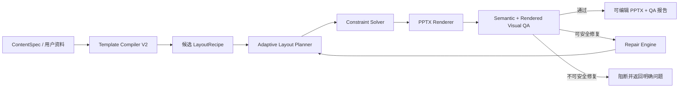
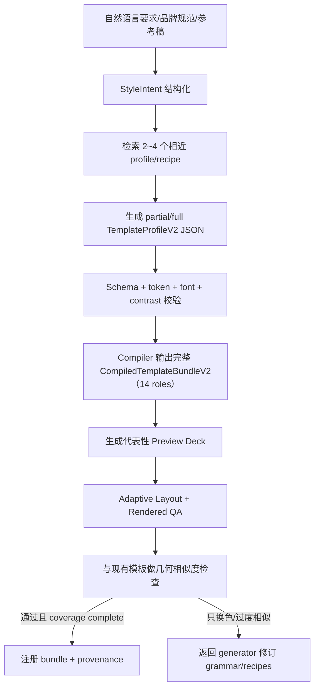

# PPTX Skill 三大能力升级：完整实现设计

> 状态：Architecture proposal — pending PR0 baseline and contract validation
>
> 日期：2026-07-18
>
> 范围：真正的视觉 QA、约束式自适应排版、生成式模板引擎 V2
>
> 目标读者：负责实现和验收当前 PPTX Skill 的工程师或 Agent

> 基线审计：2026-07-18；当前 8 项 unittest 为 5 通过、3 报错，且这 3 个 import error 会遮蔽其后的页数/目录回归。本文中的 `visual_qa.py`、adaptive API、Template V2 和相关 CLI 均为目标态设计，除非明确标为“现有能力”，否则当前不可直接调用。

## 0. 执行摘要

当前 Skill 已经具备生成、编辑、参考稿复用、备份、渲染入口和基础验收能力，但现有测试基线、模块导入和渲染隔离仍需先修复；三个核心模块也仍是启发式实现：

1. `auto_validate_ppt()` 只能检查结构统计，不能可靠发现溢出、遮挡、错误裁图和视觉回归。
2. `choose_layout()` 根据页面位置、内容字段和真实图片存在性选择固定版式，不会根据真实文本尺寸和内容密度重新求解布局。
3. `template_engine.py` 通过关键词选择基模板和几何家族，再按品牌色混合或哈希派生配色；不会生成新的设计语法和版式骨架。
4. `visual-rebuild` 当前只接受模式名称，实际与 `clone` 进入同一 exemplar 克隆路径，尚无自动重建引擎。

升级后的主链路应为：



关键工程决策：

- 使用“离散候选枚举 + Kiwi 线性约束求解”，而不是让 LLM 直接输出任意坐标。
- 使用结构检查、字体度量、渲染图像分析和视觉回归四层 QA，不能只依赖像素差或 XML。
- 模板生成输出受 JSON Schema/Pydantic 约束的声明式 `TemplateProfileV2`，不允许生成并执行任意 Python 代码。
- 先建立正式 Python package、稳定 `element_id`、`RenderTrace` 和 Manifest V3，再实现 QA 与自动修复。
- 保留现有 `pptx_helper.py` 作为兼容 facade，通过 `layout_engine="legacy|adaptive"` 渐进迁移。
- 自动修复最多两轮，且每一步必须写入 manifest；不允许无限重试或不可追踪的视觉漂移。

## 1. 范围与非目标

### 1.1 本次必须完成

- 检测文字溢出、元素越界、非预期重叠、低对比度、图片拉伸、主体裁切和视觉回归。
- 根据真实字体、画幅、内容长度和图片比例生成多个候选布局并选择最优解。
- 支持内容超载时自动缩排、换候选版式或拆页，而不是无底线缩小字体。
- 从风格意图生成设计 token、网格、布局 recipe、页面节奏和 QA 约束。
- 支持 16:9、4:3、竖版和自定义画幅。
- 保持最终 `.pptx` 可编辑，并兼容现有 manifest、参考稿 `native/clone` 路径和页面编辑接口。
- 提供单元测试、属性测试、黄金渲染测试、跨引擎测试和性能基准。

### 1.2 本次不承诺

- 完整保留或生成 PowerPoint 动画、宏、OLE、复杂 SmartArt。
- 在 LibreOffice 与 PowerPoint 之间实现逐像素一致；不同渲染引擎必须使用不同基线。
- 从扁平截图恢复原始矢量、不可见数据和原动画。
- 让模型直接生成未经验证的 OOXML、Python 或 JavaScript 并执行。
- 用一个端到端黑盒模型替换可解释、可测试的排版和验收逻辑。

## 2. 当前基线与具体缺口

| 模块 | 当前实现 | 直接缺口 | V2 落点 |
|---|---|---|---|
| 版式选择 | `choose_layout()` 按页面位置、内容字段和真实图片存在性判断；入口另有连续三页防重复 | 不理解内容密度，不测量文本 | `layout_engine.plan_slide()` |
| 几何生成 | 14 个基础 layout + 3 个非标准 family；各 family 当前缺 `table` 专属变体并回退基础版式 | 英寸坐标和 16:9 常量固定，无法求解或自动拆页 | 声明式 `LayoutRecipe` + Kiwi |
| 文字适配 | 固定字号和文本框尺寸 | 长文本溢出，中英文差异未处理 | `text_metrics.py` + fit policy |
| 图片适配 | `_fit_image_in_box()` 通过扩大图片模拟 cover | 可能覆盖相邻区域，没有真正设置 crop | `image_crop.py` 写入 crop fractions |
| 模板生成 | 关键词选基模板/家族 + 品牌色混合或哈希派生调色 | 主要仍是换色和选三种骨架 | `TemplateProfileV2` 编译器 |
| 页面节奏 | V1 catalog 保存并校验 `preferred_sequence` | `auto_generate_ppt()` 尚未消费该字段，当前不会影响实际选版 | `plan_deck_layouts()` 将其编译为跨页偏好和惩罚 |
| 目录/重生成 | 当前工作树在 sections > 3 时新增独立 TOC，不再占用首个内容 section | `regenerate()` 仍用 `layouts[1:-1]` 映射 sections，TOC 会造成错位；reference preview 测试仍硬编码旧页数，import 修复后可能继续失败 | PR0 明确 TOC 页数契约和显式 slide↔section mapping；V3 不靠位置切片 |
| 参考稿重建 | `native`、`clone` 有实际实现；`visual-rebuild` 当前复用 clone 分支 | 扁平稿没有自动可编辑重建引擎 | visual-rebuild 路由到 adaptive renderer |
| 语义追踪 | manifest 保存 sections、template 和 layout 序列 | shape 没有稳定 element ID、语义标签和重生成映射 | `RenderTrace` + Manifest V3 |
| 结构验收 | shape 数量、字符数、字号比、颜色数 | 高误报/漏报，不能发现真实视觉问题 | `visual_qa.py` 分层检查 |
| 渲染验收 | LibreOffice 26.2.4.2 可被脚本发现；当前无 PowerPoint/pywin32 | LibreOffice 缺少独立用户配置和并发隔离；auto 模式会丢失具体错误；没有机器可读 rendered QA | renderer adapter + `render_qa.py` |
| 测试 | 8 项 unittest：5 通过、3 因相对导入报错 | import 错误会遮蔽独立 TOC 带来的页数断言；没有黄金图、压力测试、跨画幅测试 | PR0 修 import、TOC/manifest 映射并达到 8/8，再增加 fixtures/golden |
| 运行时 | 系统 Python 3.14 与 Codex bundled Python 3.12 并存 | 依赖集合不同，命令未固定解释器；两套 Pillow 均无 RAQM | 受支持版本矩阵 + package/lock/bootstrap |

现有入口不要删除：

- `auto_generate_ppt()` 继续作为对外主 API。
- `auto_validate_ppt()` 先改为调用新 QA，并保留旧返回字段。
- `template_engine.py` 继续支持当前 V1 profile，并增加迁移器。
- `reference_ppt.py` 的 clone/native 逻辑继续使用；当前 visual-rebuild 不应再假装是独立重建能力，目标态必须显式路由到 adaptive renderer。
- 9 个 legacy `theme_key`、12 个 V1 profile 和现有 legacy v2 manifest（XML wrapper + `skill_version=2` payload）都必须进入兼容测试矩阵。

## 3. GitHub 调研结论

在本次调研覆盖的仓库中，尚未发现一个项目能同时提供“PowerPoint 可编辑对象 + 自适应排版 + 视觉 QA”的完整方案。可行路线是组合以下经过验证的构件，并在当前 Python 架构内实现统一数据模型。

| 项目 | 可借鉴能力 | 许可证 | 本项目采用方式 |
|---|---|---|---|
| [python-pptx](https://github.com/scanny/python-pptx) | `TextFrame.fit_text()`、`TextFitter`、OOXML 对象模型 | MIT | 直接依赖；复用字体查找和 fit 思路，补齐 CJK/富文本 |
| [Pillow](https://github.com/python-pillow/Pillow) | `getlength()`、`getbbox()`、`textbbox()` 与可选 RAQM shaping | MIT-CMU | 作为主字体度量后端，缓存真实字体测量结果 |
| [PptxGenJS](https://github.com/gitbrent/PptxGenJS) | text fit 标记、表格自动分页、母版和对象 API | MIT | 借鉴分页策略；不引入 Node 运行时 |
| [Kiwi](https://github.com/nucleic/kiwi) | 高性能 Cassowary 线性约束求解器和 Python bindings | BSD-3-Clause | 作为 adaptive layout 的核心可选依赖 |
| [Shapely](https://github.com/shapely/shapely) | Polygon 相交与 `STRtree` 空间索引 | BSD-3-Clause | 可选 geometry extra；PPTX rotation/freeform 的抽取与 polygon 化由本项目负责 |
| [Pixelmatch](https://github.com/mapbox/pixelmatch) | v7.2.0 的抗锯齿感知 diff；未发布 main 的 OKLab/HyAB 与窗口化差异实验 | ISC | 已发布版与研究 commit 分开固定；Python 内实现或可选调用 |
| [scikit-image](https://github.com/scikit-image/scikit-image) | SSIM 等图像质量度量 | 主体 BSD-3-Clause | 可选 QA extra；直接依赖即可，若复制源码需按具体文件核验 BSD-2/MIT 例外 |
| [smartcrop.js](https://github.com/jwagner/smartcrop.js) | 边缘、肤色、饱和度、候选窗口评分和通用 boost 区域 | MIT | 将算法思想实现为 Python smart crop；人脸框必须由外部检测器提供 |
| [Presenton](https://github.com/presenton/presenton) | 组件化模板、Pydantic/JSON Schema、布局预览工具、LLM 结构化输出 | Apache-2.0 | 借鉴“schema 表达约束 + 生成流程强制预览/校验重试”，不复制其前端运行时 |
| [PPTAgent](https://github.com/icip-cas/PPTAgent) | 提取 slide-level functional type/content schema、选择参考页并生成编辑动作 | MIT | 借鉴“设计归纳 → 内容结构 → 参考页选择/编辑动作”阶段划分 |
| [Style Dictionary](https://github.com/style-dictionary/style-dictionary) | 层级 design token、alias、转换和多目标输出 | Apache-2.0 | 借鉴 token/alias/transform 机制；primitive/semantic/component 是本项目自定分层 |
| [Slidev](https://github.com/slidevjs/slidev) | 可共享主题、命名 layout、内容与设计分离 | MIT | 借鉴主题包和 layout 命名机制 |
| [Marp Core](https://github.com/marp-team/marp-core) | 主题元数据、画幅预设、按元素类型启用的受控 auto-scaling | MIT | 借鉴 canvas preset 和受控缩放；不将其视为通用布局引擎 |

需要特别吸收的实现事实：

- `python-pptx` 已经使用 Pillow 字体度量和二分搜索寻找最大可用字号，但其现有换行器主要按空格分词，不足以直接覆盖中文、日文和富文本。
- Pillow 可以提供真实字体 advance/bbox；只有运行时 `features.check("raqm")` 为真时才能启用 RAQM。当前两套 Pillow 均返回 false，复杂脚本必须走明确降级路径。
- PptxGenJS 的 `fit: "shrink"`/`"resize"` 依赖 PowerPoint 打开或编辑后触发，不适合作为生成时验收；当前 Skill 必须在写文件前自己求出最终字号。
- PptxGenJS 的表格分页将“估算行高 → 计算可用高度 → 自动新页”拆成独立流程，这个思想可推广到 bullets、时间线和图片列表。
- Presenton V2 通过 Pydantic/JSON Schema 表达 content/decorative、字符长度、条目/行列范围及 flex/grid/container；预览工具和校验重试位于生成流程，而不在 schema 本身。
- 当前 V1 的 `preferred_sequence` 只被保存和合法性校验，没有进入 `auto_generate_ppt()` 的页面规划；V2 必须用端到端测试证明该配置真正改变候选序列。
- Pixelmatch 未发布 main 中的窗口化差异密度可减少散点噪声；该能力不属于 v7.2.0 release。若借鉴，必须固定审计过的 commit，并由本项目测试阈值；单纯计算全图不同像素占比不够稳定。

版本与许可证边界：关键源码链接应固定 release 或 commit。Pixelmatch 的已发布抗锯齿检测以 v7.2.0 为基线；OKLab/HyAB 与窗口密度只以固定 main commit `c6fee35afac3c52576b2cb424bd1061ab6a4bd06` 作为研究参考，不能冒充稳定 release。Kiwi Python 包名为 `kiwisolver`，当前要求 Python 3.10+。复制、修改或分发第三方代码的实质部分时，按对应许可证保留版权、许可，以及上游存在非空 NOTICE 时的相应 NOTICE/变更说明；在 `THIRD_PARTY_NOTICES.md` 记录来源与采用方式。

## 4. 目标架构

### 4.1 模块边界

```text
pptx_skill/                     # 目标最终业务实现位置；PR0 先建壳与兼容 shim
├── __init__.py
├── api.py                      # 公共 API 与兼容返回类型
├── content_model.py            # ContentSpec / SlideSpec / ElementSpec
├── content_adapter.py          # 现有 Section dict -> ContentSpec
├── design_schema.py            # ProfileV2 / CompiledTemplateBundleV2 / recipes
├── template_retriever.py       # V1/V2 profile 与 recipe 检索
├── template_compiler.py        # StyleIntent -> source ProfileV2 -> compiled bundle
├── layout_engine.py            # 候选生成、求解和评分
├── pagination.py               # 内容拆页与来源片段追踪
├── deck_planner.py             # 跨页节奏和 preferred_sequence
├── text_metrics.py             # 字体解析、换行、字号拟合
├── image_crop.py               # contain/cover/smart crop + crop fractions
├── pptx_renderer.py            # LayoutPlan -> PPTX + RenderTrace
├── legacy_renderer.py          # 现有 draw_* 的隔离 adapter
├── reference_adapter.py        # native/clone/rebuild 的参考稿读写边界
├── pptx_io.py                  # package preflight/inspect -> snapshot；edit/page + manifest
├── preview_renderer.py         # LibreOffice/COM -> PreviewRenderResult
├── visual_qa.py                # 语义检查与统一 QAReport
├── render_qa.py                # PNG、SSIM、pixel diff、标注图
├── repair_engine.py            # 只生成白名单 RepairAction
├── manifest.py                 # legacy v2 wrapper/payload / Manifest V3 迁移与读写
├── generation_pipeline.py      # plan -> render -> QA -> repair orchestration
└── cli/
    ├── generate.py
    ├── template_engine.py
    └── visual_qa.py

scripts/                        # 保留为薄 CLI/facade，不再放业务模块
├── pptx_helper.py              # 兼容现有 import 和旧 API
├── generate_ppt.py             # 目标态 CLI wrapper
├── template_engine.py          # 兼容 V1 命令并转发 V2
├── render_slides.py            # 兼容现有命令并转发 preview_renderer
└── ...                         # 现有编辑、参考稿和页面操作 wrapper

pyproject.toml                  # package、核心依赖、extras 和 CLI entry points

assets/templates/
├── catalog.json                # 现有 V1
└── v2/
    ├── catalog.json
    ├── schema.json
    └── *.json

tests/
├── fixtures/
│   ├── content/
│   ├── references/
│   ├── fonts/
│   └── annotated_qa/
├── golden/
│   ├── libreoffice/
│   └── powerpoint/
├── test_text_metrics.py
├── test_layout_engine.py
├── test_visual_qa.py
├── test_render_qa.py
├── test_template_v2.py
└── test_end_to_end_adaptive.py
```

这是 PR9 结束时的目标树，不要求 PR0 一次搬空 `scripts/`。PR0 先建立可安装 package、统一 import 和 compatibility shim；后续 PR 只在触及某块功能时迁移对应业务代码，直到 `scripts/*.py` 全部退化为薄 wrapper。迁移期间同一能力只能有一个 authoritative implementation，shim 只转发，不能复制两份逻辑。

### 4.2 依赖方向

```text
content_model        design_schema
       \                 /
        template_compiler <- template_retriever
                 |
 text_metrics -> layout_engine <- image_crop
                 |
           pagination -> deck_planner
                 |
            pptx_renderer -> RenderTrace
                 |
        visual_qa + preview_renderer + render_qa
                 |
             repair_engine
                 |
         generation_pipeline
                 |
         api / legacy facades
```

约束：

- `content_model.py`、`design_schema.py` 和 solver 不得 import `python-pptx`。
- 只有 adapter/I/O 层 `pptx_renderer.py`、`legacy_renderer.py`、`reference_adapter.py`、`pptx_io.py` 可以直接操作 `python-pptx` 对象；其中 `pptx_io.py` 承接现有 inspect/edit/page/preflight，但必须同步 manifest 或标记 stale。domain model、solver、QA 规则和 repair planner 不接触 `python-pptx`。
- `scripts/*.py` 不使用包内相对导入；通过安装后的 `pptx_skill` package 调用业务代码，消除当前 `scripts` 既像包又像顶层模块的冲突。
- `pptx_helper.py` 只作为兼容 facade，不再同时承担模型、规划、绘制和验收职责。
- `pptx_io.py` 把现有文件抽取为不含 `python-pptx` 对象的 `PptxSnapshot`；`visual_qa.py` 读取 `LayoutPlan + RenderTrace + PptxSnapshot`，不得直接打开文件或调用生成入口。
- `repair_engine.py` 只产生 `RepairAction`；`generation_pipeline.py` 负责应用动作、合并 profile overrides 并重新生成。
- 当前 14 个直接绘制函数先封装在 legacy adapter 后面，不做一次性重写。

## 5. 统一数据契约

### 5.1 坐标系统

内部统一使用 point：

- 1 inch = 72 pt。
- 16:9 默认画布约为 `959.976 × 540 pt`。
- 字号本身也是 point，便于约束求解和文字度量。
- 写入 PPTX 时统一转换为 EMU；渲染 QA 时按实际 PNG 尺寸转换为 pixel。
- Profile 中允许使用相对单位，但必须在 compiler 阶段转换为 point。

不要在新模块中混用英寸、EMU、像素和 0~1 归一化坐标。

### 5.2 核心模型

```python
from dataclasses import dataclass, field
from typing import Literal

@dataclass(frozen=True)
class SafeInsets:
    top: float
    right: float
    bottom: float
    left: float

@dataclass(frozen=True)
class CanvasSpec:
    width_pt: float
    height_pt: float
    name: str = "16:9"
    safe: SafeInsets = SafeInsets(36, 48, 32, 48)

@dataclass(frozen=True)
class BBox:
    x: float
    y: float
    width: float
    height: float

@dataclass(frozen=True)
class GeometrySpec:
    bbox: BBox
    rotation_deg: float = 0.0
    polygon: tuple[tuple[float, float], ...] | None = None

@dataclass
class ContentSpec:
    id: str
    title: str
    subtitle: str
    slides: list["SlideSpec"]
    locale: str = "zh-CN"
    metadata: dict = field(default_factory=dict)

@dataclass
class ElementSpec:
    id: str                         # 跨重生成稳定，不使用 PowerPoint shape_id
    kind: Literal["text", "image", "shape", "table", "chart", "group"]
    role: str
    content: dict
    style_ref: str
    constraints: list[dict]
    decorative: bool = False

@dataclass
class SlideSpec:
    id: str
    role: str
    communication_goal: str
    elements: list[ElementSpec]
    preferred_layouts: list[str]
    source_section_id: str | None = None
    fragment_index: int = 0

@dataclass
class PlannedNode:
    id: str                         # 稳定 render-node ID；一个 element 可对应多个 node
    element_id: str | None          # recipe decoration 可为 None
    recipe_node_id: str
    kind: str
    role: str
    geometry: GeometrySpec
    resolved_style: dict
    content_binding: dict
    z_order: int
    crop: dict | None = None
    decorative: bool = False
    parent_node_id: str | None = None

@dataclass
class LayoutPlan:
    canvas: CanvasSpec
    recipe_id: str
    nodes: list[PlannedNode]
    local_score: float
    has_blocker: bool                # 由 diagnostics 聚合，不作为独立输入
    diagnostics: list[dict]

@dataclass
class SlidePlanCandidate:
    derived_slides: list[SlideSpec]
    plans: list[LayoutPlan]          # 与 derived_slides 一一对应
    local_score: float
    diagnostics: list[dict]
    kind: Literal["single", "split"] = "single"

@dataclass
class SlidePlanResult:
    status: Literal["feasible", "infeasible"]
    candidates: list[SlidePlanCandidate]
    blockers: list[dict]
    diagnostics: list[dict]

@dataclass
class DeckPlanResult:
    status: Literal["feasible", "infeasible"]
    source_slides: list[SlideSpec]
    derived_slides: list[SlideSpec]
    plans: list[LayoutPlan]
    blockers: list[dict]
    diagnostics: list[dict]

@dataclass(frozen=True)
class RenderTraceEntry:
    render_node_id: str
    element_id: str | None
    recipe_node_id: str
    shape_instance_index: int       # 同一 node 生成多个 PPT shapes 时递增
    slide_index: int
    ppt_shape_id: int | None       # 只在本次渲染内有效
    shape_name: str
    z_order: int
    geometry: GeometrySpec
    crop: dict | None
    parent_render_node_id: str | None = None

@dataclass
class PreviewRenderResult:
    renderer: str
    renderer_version: str
    target_dpi: int
    slide_pngs: list[str]
    actual_pixel_sizes: list[tuple[int, int]]
    environment: dict
    attempts: list[dict]

@dataclass
class RenderResult:
    pptx_path: str
    trace: list[RenderTraceEntry]
    generation_engine: str
    generation_engine_version: str
    artifacts: dict[str, str]
    preview: PreviewRenderResult | None = None

@dataclass(frozen=True)
class SnapshotShape:
    slide_index: int
    ppt_shape_id: int
    name: str
    kind: str
    geometry: GeometrySpec
    z_order: int
    text: dict | None
    crop: dict | None
    semantic_tags: dict | None

@dataclass(frozen=True)
class PptxSnapshot:
    canvas: CanvasSpec
    shapes: tuple[SnapshotShape, ...]
    package_issues: tuple[dict, ...]
    provenance: dict
```

现有 `Section` dict 通过 `LegacyContentAdapter` 转成 `ContentSpec/SlideSpec`。禁止直接把旧 dict 传入 solver；否则字段缺省、封面/结尾自动插入和拆页来源都无法稳定追踪。

#### 稳定 ID 生成规则

稳定 ID 基于 lineage，不基于可编辑的标题或正文 hash：

```text
deck_namespace / source_section_id / fragment_index / logical_role / item_key
```

- 首次导入时创建并持久化 `deck_namespace`。有上游 ID 就直接命名空间化；没有时以原始 section ordinal/role 分配一次 `source_section_id` 并写入 manifest。
- `item_key` 优先使用上游业务 ID；否则首次分配持久化 key。修改文字、样式或位置不改变 ID，新插入元素获得新 key，不能重编号已有元素。
- 派生页 ID 从 `source_slide_id + fragment_index` 生成；重复表头、续页标题等节点从父 ID + `repeat_kind/index` 派生。
- `render_node_id` 从 `slide_id + element_id/recipe_node_id + occurrence` 生成。recipe decoration 没有 `element_id`，但仍有稳定 `render_node_id`。
- UUIDv5 或等价确定性算法的 namespace/version 写入 manifest；加载时执行全 deck 唯一性校验，冲突是 package blocker。

这样 repair 或人工编辑内容后仍能关联旧 QA；“相同输入 + 相同 manifest/seed”可重放，而不是要求内容变化后重新 hash 成另一个元素。

### 5.3 QA 结果模型

```python
from dataclasses import dataclass
from enum import Enum

class Severity(str, Enum):
    INFO = "info"
    WARNING = "warning"
    BLOCKER = "blocker"

class CheckOutcome(str, Enum):
    PASS = "pass"
    FAIL = "fail"
    INCONCLUSIVE = "inconclusive"

@dataclass
class QACheckResult:
    check_id: str
    outcome: CheckOutcome
    confidence: float
    evidence: dict
    issue_codes: list[str]

@dataclass
class QAIssue:
    code: str
    severity: Severity
    slide_index: int
    element_id: str | None
    render_node_id: str | None
    ppt_shape_id: int | None
    bbox: BBox | None
    message: str
    evidence: dict
    suggested_repairs: list[str]
    confidence: float

@dataclass
class QAReport:
    status: CheckOutcome
    checks: list[QACheckResult]
    issues: list[QAIssue]
    render_result: RenderResult | None
    metrics: dict
    artifacts: dict
```

目标态 CLI 必须支持 `--json`，终端文本只是展示层；当前 CLI 尚未统一支持该选项。

`Severity` 表示 issue 的影响，`CheckOutcome` 表示检查或整份报告的结论。`PASS` 可出现在 `QACheckResult.outcome` 和 `QAReport.status`，但不会创建“通过的 issue”。复杂图片背景、透明叠加、缺少字体或渲染后端时不得强行给出二元结论，应输出 `inconclusive`、置信度和缺失证据；strict 模式可按 profile 决定是否将 inconclusive 升格为 blocker。

兼容 facade 将新报告映射回现有 `{"passed", "checks", "warnings", "total_slides"}`，至少维持一个完整弃用周期。

### 5.4 Manifest V3

现有 JSON payload 没有独立的 `manifest_schema_version`，但 embedded XML wrapper 使用 `...:manifest:v2` namespace 和 `version="2"`，payload 又有 `skill_version=2`；三者目前没有形成一个被校验的单一 schema 契约，内容主要是 sections、template 和 layouts。本文把这组格式称为“legacy v2 manifest”，不能与 TemplateProfile JSON Schema V2 混同。目标态新增显式 Manifest V3：

```json
{
  "manifest_schema_version": 3,
  "template_schema_version": 2,
  "current": {
    "content": {"slides": []},
    "layout_plans": [],
    "render_trace": []
  },
  "attempts": [
    {
      "run_id": "20260718T120000Z-a1b2c3",
      "pass_index": 0,
      "plan_artifact": "artifacts/pass-00.plan.json",
      "trace_artifact": "artifacts/pass-00.trace.json",
      "qa_artifact": "artifacts/pass-00.qa.json",
      "repairs_applied": [],
      "sha256": {}
    }
  ],
  "renderer_environment": {},
  "repair_log": [],
  "manifest_stale": false,
  "legacy": {"theme_key": null, "source_skill_version": 2}
}
```

要求：

- `template_schema_version` 与 project manifest version 是两套独立版本号。
- 读取 legacy v2 wrapper/payload 时只做内存迁移，不强制改写用户文件；写 V3 时 XML namespace/root version 与 payload `manifest_schema_version` 必须一致，reader 对不一致返回 package blocker。
- `ppt_pages.py`、编辑 API、拆页和 repair 必须同步 manifest；无法同步时明确标记 `manifest_stale=true`。
- `current` 只表示最后一次成功结果；每轮 plan/trace/QA/repair 以 append-only `attempts` 保存 artifact 路径和 hash，失败轮次也保留，不能用最后一份报告覆盖历史。
- native/clone 至少生成 QA sidecar、参考稿 provenance 和 shape mapping，即使不写入完整可重放内容模型。

## 6. 能力一：真正的视觉 QA

### 6.1 分层检查

QA 必须按以下顺序执行：

1. Package preflight：文件能否打开、关系是否完整、媒体是否丢失。
2. Semantic geometry：对象边界、文字容量、颜色、字体和 crop 信息。
3. Rendered image：实际渲染结果中的空白、边缘裁切、视觉差异和异常区域。
4. Deck-level：页面节奏、重复构图、样式漂移和跨页一致性。

前一层出现 package blocker 时，不继续执行依赖渲染的检查。

语义检查分两条证据路径：adaptive renderer 生成的页面必须使用 `ElementSpec.id + RenderTrace`；现有 legacy、native、clone 或第三方 PPTX 若没有稳定语义标签，只能使用 shape 类型、名称和几何关系做有限推断。凡是“是否有意重叠”“是否允许越过安全区”等依赖设计意图的检查，在缺少 manifest/recipe 证据时默认返回 `inconclusive`，不得用猜测制造 blocker。

### 6.2 检查项与算法

| Issue code | 检查 | 算法 | 默认修复 |
|---|---|---|---|
| `SHAPE_OUT_OF_BOUNDS` | 对象超出画布/安全区 | BBox 与 canvas/safe-margin 相交；应用 bleed/decoration 例外 | 移回 zone 或换候选布局 |
| `UNINTENDED_OVERLAP` | 非预期重叠 | 矩形交集率 + z-order + role allowlist | solver 重新求解 |
| `TEXT_OVERFLOW_ESTIMATED` | 结构层推测文字容量不足 | 字体真实度量 + 换行 + 最小字号检查 | fit、扩区、换布局或拆页 |
| `TEXT_OVERFLOW_CONFIRMED` | PowerPoint 或等价排版引擎确认裁字/遮挡 | 实际文本边界超过有效 frame，并由渲染结果佐证 | 阻断并重新排版 |
| `FONT_MISSING` | 字体不可用/回退 | FontResolver 与本机字体表比对 | 使用 profile fallback |
| `LOW_CONTRAST` | 文本与背景对比不足 | 纯色计算；图片背景局部采样 | 改文字色或加受控底层 |
| `IMAGE_DISTORTED` | 图片比例被拉伸 | 原图比例与 shape/crop 后比例比对 | 改为 crop/contain |
| `IMAGE_SUBJECT_CROPPED` | 主体落在 crop 外 | saliency/face boost 的保留率 | 调整 focus point |
| `IMAGE_LOW_RESOLUTION` | 投影清晰度不足 | 有效像素 ÷ 显示尺寸/DPI | 换图或降低显示面积 |
| `EMPTY_PLACEHOLDER` | 遗留占位符 | placeholder + 空内容/模板文本 | 删除或填充 |
| `VISUAL_REGRESSION` | 与基线/参考稿差异过大 | pixel diff density + SSIM | 阻断，要求定位差异 |
| `LAYOUT_REPETITION` | 相邻构图过度重复 | geometry signature 相似度 | deck planner 换 variant |
| `STYLE_DRIFT` | 字体/色彩/页脚漂移 | token 使用率和位置聚类 | 重放 profile tokens |

### 6.3 重叠检测

对每页非 background 对象构造几何区域。对象数通常低于 100，轴对齐对象第一版直接使用 BBox 与 `O(n²)`，不必引入空间索引依赖。对象存在 rotation、freeform 或非矩形裁切时，使用 Shapely polygon 相交；若 optional geometry extra 缺失，则标记 `geometry_approximation=true`，对可能受影响的结论返回 inconclusive，而不是把包围盒误判成真实重叠。超过 200 个对象或批量处理时再启用 `STRtree`。

```text
intersection_ratio = intersection_area / min(area_a, area_b)
```

只有以下情况默认允许重叠：

- 标为 `decorative=true` 的背景、分隔线、遮罩。
- 文本与其声明的容器/背景形状。
- 图片与 overlay 文本，且 recipe 明确设置 `allow_overlap`。
- group 内部由 recipe 声明的叠放关系。

不能通过“形状类型相同”推断允许重叠。所有例外都应来源于 recipe 或 manifest 中的语义标签。

安全区也不是所有对象的硬边界。`background`、显式 `full_bleed=true` 的图片、裁切遮罩和声明了 `bleed_edges` 的装饰元素可以进入安全区外，但仍不得越出画布；正文、标题、Logo、页码、来源和交互性内容必须留在安全区内。无这些语义标签的旧文件只报告“进入安全区”的 warning/inconclusive，只有真正越出画布才可直接失败。

初始阈值建议：

- 交集率 `< 0.01`：忽略浮点/阴影边缘误差。
- `0.01 ~ 0.05`：warning。
- `> 0.05` 且不在 allowlist：blocker。

阈值必须通过标注 fixture 校准，不作为永恒常量。

### 6.4 文字溢出检测

不要只用字符数估算。实现 `TextMeasurer`：

```python
class TextMeasurer(Protocol):
    def measure(
        self,
        runs: list[TextRun],
        width_pt: float,
        paragraph_style: ParagraphStyle,
        font_size_pt: float,
        locale: str,
    ) -> TextMetrics: ...
```

步骤：

1. `FontResolver` 将字体家族、粗细、斜体解析为真实字体文件。
2. 使用 Pillow `getlength/getbbox/textbbox` 测量；环境支持时启用 RAQM，复杂脚本可再使用 HarfBuzz fallback。
3. 以 run 为单位测量，保留粗体、字号和中英文混排差异。富文本拟合只二分搜索一个全局 scale factor，各 run 的相对字号、基线和强调关系保持不变，不得扁平化成单一字体。
4. 拉丁文字按单词断行；CJK 按 grapheme/字符断行，并实现行首行尾禁则。
5. 计算行宽、总高度、段前后间距、项目符号缩进和文本框内边距，并预留 3%~5% renderer safety margin。
6. 对字号/全局 scale 做二分搜索，得到 `required_font_size`。
7. 若 `required_font_size < style.min_font_size`，不是继续缩小，而是请求重新排版或拆页。
8. 缓存 `(font_file, weight, size, text, features, language, width)` 的测量结果；字体文件 mtime 或版本改变时失效。

`python-pptx.TextFrame.fit_text()` 可作为单一字体、简单文本的快速路径；富文本和 CJK 必须走自定义 measurer。结构层只能产出 `TEXT_OVERFLOW_ESTIMATED`。PowerPoint integration 可读取 `TextFrame2.TextRange.BoundWidth/BoundHeight`，与扣除 inset 后的有效 frame 比较，再用导出图确认裁切；OCR、边缘和像素启发式只作佐证，不能单独产生 blocker。当前机器没有 PowerPoint/pywin32，因此 LibreOffice-only 路径对无法确证的文字溢出必须返回 `inconclusive`，不能伪装成 `TEXT_OVERFLOW_CONFIRMED`。

### 6.5 对比度检测

- 纯色背景：计算文本色与背景色的相对亮度和对比比。
- 渐变/图片背景：将文本 BBox 映射到渲染 PNG，采样九宫格或文字 mask 周围像素，使用最低分位数而非均值。
- 大号文字和普通文字使用不同阈值；阈值写入 profile 的 `qa.contrast`。
- 结果必须是 `pass/fail/inconclusive`；不确定背景、复杂透明叠加或无法获得 rendered pixels 时返回 warning + confidence，而不是假装精确。
- 只有纯色背景或高置信 rendered sampling 才允许自动修复颜色；否则建议增加受控底板或交给人工确认。

### 6.6 图片裁切和主体保护

第一版将 smart crop 实现为纯 Python：

1. 缩小到最长边 256~512 px。
2. 计算 Laplacian/边缘、饱和度和肤色近似图。
3. 可选使用 OpenCV 人脸检测产生 boost boxes。
4. 按目标宽高比生成候选 crop window。
5. 对候选窗口计算细节、中心权重、三分法和边缘惩罚。
6. 返回 focus point 和 crop rect。
7. 在 PPTX picture shape 上写入真实 `crop_left/right/top/bottom`，禁止通过放大 picture 越出目标框模拟 crop。

QA 记录：

```json
{
  "saliency_retained": 0.93,
  "face_retained": 1.0,
  "crop_fraction": 0.28,
  "focus": [0.62, 0.41]
}
```

### 6.7 渲染视觉回归

同一渲染引擎内同时计算：

- 感知像素差：忽略抗锯齿，输出 diff mask。
- 窗口化差异密度：捕获局部真实回归，降低散点噪声。
- SSIM：检测大区域结构变化。
- 边缘差：对文字、线条和布局移动更敏感。

不同渲染引擎不能共用同一黄金图。目录按以下方式隔离：

```text
tests/golden/libreoffice/<version>/<font-pack>/...
tests/golden/powerpoint/<version>/<font-pack>/...
```

baseline key 至少包含 `renderer + renderer_version + OS + font_pack + target_dpi + actual_pixel_size + color_space + PNG_encoder_version`。每次运行都把这些字段写入 `qa.json`；任一关键字段变化时不得直接与旧基线比较。

renderer adapter 必须先满足以下进程与产物契约：

- 每次 LibreOffice 转换使用唯一临时目录和唯一 `-env:UserInstallation=file:///...` 用户配置，避免已有 LibreOffice 进程或并发任务吞掉转换请求。
- 检查 `returncode/stdout/stderr`，只接受本次运行开始后在唯一目录内产生且能成功打开的 PDF；禁止把旧 PDF 当作成功结果。
- PDF、PNG 和 PowerPoint 导出文件按页码自然排序，不使用会把 `Slide10` 排在 `Slide2` 前面的纯字符串排序。
- COM 对象在 `finally` 中按 `presentation.Close()`、`application.Quit()` 清理；中途异常也不能残留后台 PowerPoint。
- `engine="auto"` 返回每个尝试过的后端及其具体错误，不得把真实转换错误折叠成泛化的 “No rendering engine available”。

当前 `render_with_com(pptx_path, output_dir, dpi)` 接收 `dpi`，但 `Presentations.Export(..., "PNG")` 没有使用该参数。启用 PowerPoint COM 黄金测试前必须按 `round(slide_width_pt / 72 * dpi)` 和 `round(slide_height_pt / 72 * dpi)` 计算像素尺寸，并传给 `Presentation.Export(Path, FilterName, ScaleWidth, ScaleHeight)`；导出后再校验并记录实际 PNG 宽高。不能把事后缩放当成同等黄金基线。当前环境没有 PowerPoint，因此它是 COM integration 的前置条件，不应排在修复现有 unittest 和 LibreOffice 隔离之前。

建议初始阈值，仅用于建立 fixture 后校准：

```yaml
same_engine:
  perceptual_threshold: 0.10
  max_window_diff_density: 0.015
  min_ssim: 0.985
reference_clone:
  max_window_diff_density: 0.08
  min_ssim: 0.94
```

参考稿 clone 比较应支持忽略明确替换的内容区域，仅比较结构、品牌元素和未映射区域。

### 6.8 输出物

每次 strict QA 产生：

```text
output/report.qa.json
output/report.qa.md
output/report-preview/slide_001.png
output/report-preview/annotated/slide_001.png
output/report-preview/diff/slide_001.png
```

标注图使用红/橙/蓝分别表示 blocker、warning、info，并在对象旁标注 issue code。

## 7. 能力二：约束式自适应排版

### 7.1 为什么不能只用一个约束求解器

“A 在 B 左边或右边”以及“选择两栏还是上下结构”属于离散决策；Cassowary/Kiwi 主要解决线性连续约束。正确架构是：

1. Recipe 生成若干离散候选拓扑。
2. Kiwi 为每个候选求解 `x/y/w/h` 等连续变量。
3. TextMeasurer、ImageCropper 和 QA 对候选评分。
4. 选择无 blocker 且得分最低的候选。

不要把所有非重叠关系写成难以维护的 if/else，也不要强行把离散决策塞进线性约束。

### 7.2 LayoutRecipe 示例

```json
{
  "id": "editorial.text_image.asymmetric_left",
  "role": "text_image",
  "variant": "asymmetric_left",
  "zones": {
    "title": {"kind": "text", "style": "component.title"},
    "body": {"kind": "text-list", "style": "component.body"},
    "hero": {"kind": "image", "fit": "smart-cover"}
  },
  "constraints": [
    {"terms": [{"var": "title.left", "coef": 1}], "op": "==", "rhs": {"ref": "canvas.safe_left"}, "strength": "required"},
    {"terms": [{"var": "title.top", "coef": 1}], "op": "==", "rhs": {"ref": "canvas.safe_top"}, "strength": "required"},
    {"terms": [{"var": "body.top", "coef": 1}, {"var": "title.bottom", "coef": -1}], "op": ">=", "rhs": {"token": "semantic.space.component"}, "strength": "required"},
    {"terms": [{"var": "hero.left", "coef": 1}, {"var": "body.right", "coef": -1}], "op": ">=", "rhs": {"token": "primitive.space.6"}, "strength": "strong"},
    {"terms": [{"var": "hero.right", "coef": 1}], "op": "==", "rhs": {"ref": "canvas.safe_right"}, "strength": "required"},
    {"terms": [{"var": "hero.height", "coef": 1}, {"var": "hero.width", "coef": -0.5625}], "op": "==", "rhs": {"const": 0}, "strength": "medium"}
  ],
  "content_limits": {
    "body.max_items": 6,
    "body.min_font_size": 16,
    "title.max_lines": 2
  },
  "fallbacks": [
    "editorial.text_image.stacked",
    "editorial.bullets.wide"
  ]
}
```

schema 只接受上述结构化线性 AST，不接受自由字符串表达式。`terms[].coef` 和 `rhs.const` 必须是有限数值，`ref/token` 必须存在，`op` 只允许 `==/>=/<=`，`strength` 只允许 Kiwi 的受控等级；编译器拒绝变量相乘、变量作除数、任意函数和循环引用。图片目标宽高比在候选 recipe 生成时固化为系数，例如 `hero.height - 0.5625 * hero.width == 0`，不能把非线性除法交给 Kiwi。

### 7.3 求解流程

```python
def plan_slide(
    slide: SlideSpec,
    profile: TemplateProfileV2,
    canvas: CanvasSpec,
    context: DeckLayoutContext,
) -> SlidePlanResult:
    topologies = candidate_generator.generate(slide, profile, context)
    solved = [solve_candidate(c, slide, profile, canvas) for c in topologies]
    bundles = [
        SlidePlanCandidate([slide], [plan], plan.local_score, plan.diagnostics)
        for plan in solved
        if not plan.has_blocker
    ]
    if not bundles or min(x.local_score for x in bundles) > context.split_score:
        bundles.extend(
            pagination.plan_split_candidates(slide, profile, canvas, context)
        )
    bundles = [x for x in bundles if all(not p.has_blocker for p in x.plans)]
    if not bundles:
        return overflow_policy.fail(slide, solved)
    return SlidePlanResult(
        status="feasible",
        candidates=sorted(bundles, key=lambda x: x.local_score)[:context.max_candidates],
        blockers=[],
        diagnostics=collect_diagnostics(solved, bundles),
    )
```

一个 `SlidePlanCandidate` 是不可拆分的候选束：可能是一张未拆页，也可能包含多张派生页，且 `derived_slides` 与 `plans` 一一对应。`plan_slide()` 保留有界 top-k，而不是先选单页最佳；这样 deck planner 才能用跨页节奏选择第二或第三局部候选。不可行时 `fail()` 必须返回 `status="infeasible"`、空 candidates 和非空 blockers；调用者不靠“猜 diagnostics 内容”判断失败，也不把拆页藏在异常或全局状态里。

每个候选至少执行：

1. 根据内容创建变量和初始尺寸。
2. 使用真实字体度量计算文本最小/理想高度。
3. 向 Kiwi 添加 required/strong/medium/weak 约束并求解。
4. 用求解后的实际宽度重新测量文本、更新 `min_h/ideal_h`，重复“求解 → 测量 → 更新约束”2~4 次，直到尺寸变化低于阈值或达到迭代预算。
5. 转换为 BBox，并计算文字 fit、交集、留白、对齐、裁切和重复惩罚。
6. 仅对 `floatable=true` 的标签、注释和数据标记执行局部 collision relaxation；正文、标题和主视觉必须回到 recipe/solver 重算。
7. 生成候选 diagnostics，记录迭代次数、残余误差和 infeasible constraint set。

### 7.4 硬约束与软约束

硬约束：

- 对象不得超出画布；除显式 full-bleed/decoration 例外外，内容对象不得超出安全区。
- 正文不得小于 profile 规定的最小字号。
- 标题与正文不能发生未声明重叠。
- 图片、表格和图表的宽高必须为正并达到最小可读尺寸。
- Logo、页脚等锁定区域不可被内容占用。

软约束：

- 对齐到网格和 baseline。
- 维持目标留白比例。
- 保持理想图片宽高比。
- 保持标题与正文的理想字号级差。
- 避免相邻页使用相同 geometry signature。
- 尽量不改变模板的主要阅读路径。

### 7.5 候选评分

```text
local_score =
  1000 * blocker_count
  + 120 * overflow_ratio
  + 100 * unintended_overlap_ratio
  + 70  * out_of_bounds_ratio
  + 25  * crop_subject_loss
  + 20  * density_penalty
  + 12  * alignment_penalty
  + 10  * hierarchy_penalty
  + 4   * deviation_from_recipe

transition_score(previous_bundle, current_bundle) =
  8 * adjacent_geometry_similarity
  + 6 * rhythm_rule_penalty
  + 6 * preferred_sequence_penalty
  + 4 * section_transition_penalty

beam_score = sum(local_score) + sum(transition_score)
```

`plan_slide()` 的 top-k 和 split threshold 只使用 `local_score`；尚未选择相邻页时不得提前计算 `adjacent_similarity`。deck planner 仅在连接候选束时计算 `transition_score`，避免相邻惩罚被重复计分。权重放入 `LayoutScoringConfig`，通过标注集调参，不散落在 layout 函数里。

### 7.6 内容超载策略

处理顺序必须固定且可审计：

1. 减少不必要的段前后间距，但不破坏层级。
2. 在允许范围内减小字号。
3. 扩大文本区域，同时收缩次要视觉区域。
4. 切换同角色的高容量候选布局。
5. 将 bullets/table/timeline 按语义边界拆到下一页。
6. 若仍不可行，返回 blocker，要求减少内容或允许更多页。

禁止：

- 正文无条件缩到 10pt 以下。
- 将所有文字压进一个超高密度页面。
- 按字符数机械截断用户内容。
- 拆开不可分割的标题—说明、指标—单位或图表—来源组合。

### 7.7 自动拆页

为可重复内容定义分页器：

```python
def paginate_items(
    items: list[ContentItem],
    capacity_fn: Callable[[list[ContentItem]], FitResult],
    keep_with_next: set[int],
    min_items_per_page: int,
) -> list[list[ContentItem]]: ...
```

支持：

- bullets：尽量 3~7 条/页，保持二级说明和主 bullet 在同页。
- table：重复表头，按实际行高分页。
- timeline：按阶段分组，不拆单一阶段。
- process：优先换成两行或纵向候选，仍不够再分页。
- image grid：根据图片数量选择 2/3/4/6 图布局，避免极小图片。

### 7.8 整本页面节奏

单页最优不等于整本最优。新增：

```python
def plan_deck_layouts(
    slides: list[SlideSpec],
    profile: TemplateProfileV2,
    beam_width: int = 8,
) -> DeckPlanResult: ...
```

分页所有权只属于 `pagination` 模块，并由 `plan_slide()` 在无可行单页或密度分数超过阈值时调用。deck planner 不再二次拆页；它为每个 source slide 获取 `SlidePlanResult.candidates`，把每个一页或多页候选束作为 beam-search 转移，再对展开后的真实派生序列计算节奏与 `preferred_sequence` 惩罚。每个派生页带 `source_section_id/fragment_index`，每个派生元素保留稳定 `element_id`，重复表头等新元素使用确定性派生 ID。

使用 beam search 或动态规划，对以下项目施加跨页惩罚：

- 相邻 geometry signature 太相似。
- 连续多页密度相同。
- section 前后没有视觉节奏变化。
- dashboard/quote/full-image 等强调页出现过密。
- 封面、章节页和结尾页不属于同一视觉家族。

## 8. 能力三：生成式模板引擎 V2

### 8.1 核心原则

模板生成器只生成“受约束设计系统”，不生成任意绘图代码。区分两个产物：`TemplateProfileV2` 是可人工编写/生成的 source profile，允许只覆盖部分 role；`CompiledTemplateBundleV2` 是 token 全解析、fallback 全展开、包含 14 个 role recipe 的可执行注册产物。最终 bundle 包含：

- design tokens；
- canvas 和 safe area；
- grid/axis/column 等 layout grammar；
- 14 种内容角色的多个 recipe；
- 页面节奏规则；
- 图片和图表风格；
- 内容容量限制；
- QA 阈值和 fallback；
- provenance、schema version 和迁移信息。

Token 使用三层结构，compiler 只允许从上到下引用：

```text
Primitive  原始值：palette.blue.600、font.size.7、space.4
    ↓
Semantic   语义值：color.text.primary、color.surface.raised、space.section
    ↓
Component  组件值：title.color、metric.value.size、table.header.fill
```

这样品牌换色、暗色模式和组件局部覆盖不会直接修改散落的十六进制色值。Layout AST 限定为 `grid/flex/stack/anchor/group/text/image/chart/table/vector/infographic` 等受控节点；节点只能引用 token、内容 slot 和白名单属性，禁止任意代码或任意 OOXML。

### 8.2 TemplateProfileV2（partial source 示例）

```json
{
  "schema_version": 2,
  "kind": "template-source-profile",
  "id": "precision-instrument",
  "name": "Precision Instrument",
  "description": "深色、克制、精密仪器感的产品发布模板",
  "canvas": {
    "preset": "16:9",
    "width_pt": 959.976,
    "height_pt": 540,
    "safe_margin": {"top": 38, "right": 52, "bottom": 34, "left": 52}
  },
  "tokens": {
    "primitive": {
      "palette": {
        "ink_950": "#08100F",
        "ink_850": "#111D1B",
        "paper_050": "#F0F4F2",
        "sage_400": "#97A8A2",
        "mint_400": "#47D7AC",
        "amber_400": "#FFB454"
      },
      "font": {
        "family": {"display": "Aptos Display", "body": "Microsoft YaHei"},
        "size": {"hero": 58, "title": 32, "body": 17, "label": 10},
        "min": {"title": 26, "body": 15, "label": 9},
        "line_height": {"title": 1.08, "body": 1.35}
      },
      "space": {"1": 4, "2": 8, "3": 12, "4": 16, "6": 24, "8": 32, "12": 48, "16": 64},
      "stroke": {"hairline": 0.75, "regular": 1.25},
      "radius": {"none": 0, "small": 3}
    },
    "semantic": {
      "color": {
        "canvas": {"$ref": "primitive.palette.ink_950"},
        "surface_raised": {"$ref": "primitive.palette.ink_850"},
        "text_primary": {"$ref": "primitive.palette.paper_050"},
        "text_muted": {"$ref": "primitive.palette.sage_400"},
        "accent": {"$ref": "primitive.palette.mint_400"},
        "signal": {"$ref": "primitive.palette.amber_400"}
      },
      "type": {
        "display_family": {"$ref": "primitive.font.family.display"},
        "body_family": {"$ref": "primitive.font.family.body"},
        "title_size": {"$ref": "primitive.font.size.title"},
        "body_size": {"$ref": "primitive.font.size.body"}
      },
      "space": {
        "section": {"$ref": "primitive.space.12"},
        "component": {"$ref": "primitive.space.4"}
      }
    },
    "component": {
      "title": {
        "color": {"$ref": "semantic.color.text_primary"},
        "family": {"$ref": "semantic.type.display_family"},
        "size": {"$ref": "semantic.type.title_size"}
      },
      "body": {
        "color": {"$ref": "semantic.color.text_primary"},
        "family": {"$ref": "semantic.type.body_family"},
        "size": {"$ref": "semantic.type.body_size"}
      },
      "metric_value": {
        "color": {"$ref": "semantic.color.accent"},
        "size": {"$ref": "primitive.font.size.hero"}
      },
      "table_header": {"fill": {"$ref": "semantic.color.surface_raised"}}
    }
  },
  "grammar": {
    "family": "technical_axis",
    "grid": {"columns": 12, "gutter": 16},
    "primary_axes": ["left", "baseline", "data-axis"],
    "reading_paths": ["f", "column"],
    "whitespace_ratio": {"min": 0.20, "target": 0.28}
  },
  "layouts": {
    "cover": ["precision.cover.axis", "precision.cover.poster"],
    "bullets": ["precision.bullets.rail", "precision.bullets.wide"],
    "text_image": ["precision.text_image.asymmetric_left"],
    "dashboard": ["precision.dashboard.lead_metric", "precision.dashboard.axis"]
  },
  "coverage": {
    "status": "partial",
    "roles": ["cover", "bullets", "text_image", "dashboard"]
  },
  "rhythm": {
    "avoid_adjacent_same_signature": true,
    "emphasis_interval": [3, 5],
    "rules": [
      {"after": "dashboard", "prefer": ["section", "text_image"], "avoid": ["dashboard"]}
    ]
  },
  "qa": {
    "contrast": {"body_min": 4.5, "large_min": 3.0},
    "max_colors_per_slide": 7,
    "min_body_font_size": 15,
    "max_crop_subject_loss": 0.12
  },
  "provenance": {
    "generator": "template-compiler-v2",
    "seed": 184077,
    "source_profiles": ["executive-dark", "data-story"]
  }
}
```

`$ref` 语法是本项目的 schema 选择，不是 Style Dictionary 强制的数据模型。compiler 将 token 图做拓扑排序，拒绝缺失引用和循环，再输出完全解析的 immutable token map；renderer 不直接解释未解析 `$ref`。

这个 JSON 只是三角色 MVP 加 cover 的 source profile，不能直接注册为正式模板。compiler 必须补全或显式继承其余 role，输出 `CompiledTemplateBundleV2(kind="compiled-template-bundle", coverage.status="complete")`；只有 bundle 可进入 catalog 和 release gate。编译产物记录每个 recipe 的来源是 generated、inherited 还是 migrated，避免“缺 role 时静默回退到任意 legacy layout”。

### 8.3 生成管线



### 8.4 StyleIntent

模型或 Agent 首先输出：

```json
{
  "industry": "precision instruments",
  "audience": "board and enterprise buyers",
  "tone": ["precise", "restrained", "technical"],
  "density": "high",
  "image_style": "macro product photography",
  "geometry": ["axes", "hairlines", "asymmetry"],
  "avoid": ["rounded cards", "gradient glow", "decorative circles"],
  "brand_colors": ["#184E77", "#F4A261"],
  "canvas": "16:9",
  "font_constraints": ["must support Simplified Chinese"]
}
```

核心 compiler 不直接依赖某个 LLM SDK。提供接口：

```python
class StyleIntentProvider(Protocol):
    def from_prompt(self, prompt: str, context: dict) -> StyleIntent: ...
```

在 Codex Skill 工作流中，Agent 可以直接生成经 schema 校验的 StyleIntent；CLI 可继续提供确定性的 heuristic provider，或通过显式插件接入模型。这样避免把密钥和供应商 SDK写死在 PPTX 引擎中。

确定性契约基于“规范化后的 `StyleIntent` JSON + compiler version + catalog revision + seed”，而不是原始自然语言 prompt。相同契约输入必须产生字节级稳定的 profile JSON；Preview PPTX 是否字节级一致不作承诺，但其 LayoutPlan、稳定 ID 和 geometry signature 必须一致。

### 8.5 从“选模板”升级为“编译设计语法”

V2 compiler 需要做四类生成：

1. Token synthesis：色彩、字体、字号比例、间距、线宽、圆角和透明度。
2. Grammar selection：网格、轴线、海报列、图像裁切、对齐和阅读路径。
3. Recipe synthesis：为每个 role 组合 zones、约束、内容容量和 fallback。
4. Rhythm planning：定义跨页强调频率、相邻限制和章节转换。

允许使用经过审查的 primitive：

```text
grid, axis, column, stack, split, overlay, rail, full-bleed,
text, text-list, metric, table, chart, image, line, shape, group
```

禁止 profile 携带 Python 表达式、import、任意模板字符串执行或文件路径遍历。

### 8.6 防止“只换颜色”

为每个 recipe 计算 geometry signature：

- 元素 role；
- 归一化 BBox；
- reading order；
- 对齐轴；
- 图文面积比例；
- 密度和留白；
- 主要视觉入口位置。

生成新模板后，与 catalog 中相同 role 的代表页计算最近邻相似度。以下情况拒绝注册：

- 颜色/字体明显变化，但 geometry similarity 高于 0.85。
- 14 个 role 中超过 70% 直接继承同一基模板 recipe，且无参数结构变化。
- cover/section/end 不属于同一 family。
- 页面节奏序列与基模板完全一致，只换 profile 名称。

### 8.7 V1 迁移

```python
def migrate_profile_v1_to_v2(profile: dict) -> TemplateProfileV2:
    # id/name/description/use_cases -> metadata
    # generated_from -> provenance.legacy_generated_from
    # theme -> tokens.primitive.palette + tokens.semantic.color aliases
    # fonts -> primitive/semantic typography tokens
    # layout_family -> grammar preset
    # layout_opts -> recipe overrides
    # preferred_sequence -> rhythm hints
    # end_title -> legacy end-slide content default
    # unknown keys -> extensions.legacy_v1 (round-trip preservation)
    ...

def v2_to_legacy_theme(profile: TemplateProfileV2) -> dict:
    # 将已解析 semantic tokens 映射回现有 choose_theme()/draw_* 所需字段
    # 只保证 legacy renderer 行为兼容，不声称保留 V2 全部 grammar/recipe 语义
    ...
```

迁移后的 profile 标记：

```json
{"provenance":{"migrated_from":1,"manual_review_required":true}}
```

V1 profile 仍可加载；catalog loader 按 schema version 分派，调用 adaptive engine 时只在内存中迁移到 V2，不强制改写用户已有 JSON。迁移器必须覆盖当前真实字段 `id/name/description/use_cases/generated_from/theme/fonts/layout_family/layout_opts/preferred_sequence/end_title`，其中 `id` 保持注册身份，`generated_from` 进入 provenance；未知字段原样保存在 `extensions.legacy_v1`，写回 V1 时恢复。所谓兼容是“9 个 legacy `theme_key`、12 个现有 profile 的既有入口和视觉行为不回归”，不是 V1 与 V2 之间任意字段的无损双向转换。

## 9. 三项能力的闭环集成

### 9.1 目标 API（当前不可调用）

以下参数和返回模型是完成相应 PR 后的目标契约。当前 `auto_generate_ppt()` 没有 `layout_engine/qa_mode/auto_repair/max_repair_passes/renderer_engine/target_dpi/return_result` 等参数，仍走 legacy renderer；文档示例不得当作现有 API 使用。

```python
auto_generate_ppt(
    title="...",
    sections=sections,
    output_path="output/report.pptx",
    template_key="strategy-consulting",
    layout_engine="adaptive",     # legacy | adaptive
    qa_mode="strict",             # off | report | strict
    auto_repair=True,              # 与 qa_mode 分离
    max_repair_passes=2,
    canvas="16:9",
    renderer_engine="auto",       # auto | libreoffice | com
    target_dpi=150,
    reference_baseline=None,
    return_result=False,
)
```

目标结构化返回值：

```python
GenerationResult(
    pptx_path="...",
    manifest_path="...",
    qa_report_path="...",
    qa_status="pass",             # pass | fail | inconclusive | None
    render_trace_path="...",
    preview_dir="...",
    repair_passes=1,
)
```

为了兼容现有调用，默认仍返回字符串路径，并通过新增 `return_result=True` 显式启用结构化返回值。兼容测试必须锁定现有位置参数、关键字参数、异常类型和字符串返回路径。

### 9.2 Orchestrator

```python
profile_state = profile
repair_budget = max_repair_passes if qa_mode != "off" and auto_repair else 0
for pass_index in range(repair_budget + 1):
    deck_plan = plan_deck_layouts(slide_specs, profile_state)
    if deck_plan.status == "infeasible":
        raise LayoutPlanningError(deck_plan.blockers)
    render_result = pptx_renderer.render(
        deck_plan.plans,
        output_path,
        slide_specs=deck_plan.derived_slides,
    )
    if qa_mode == "off":
        report = None
        break
    render_result.preview = preview_renderer.render(
        render_result.pptx_path,
        engine=renderer_engine,
        dpi=target_dpi,
    )
    report = validate_deck(
        render_result,
        plans=deck_plan.plans,
        profile=profile_state,
    )
    if report.status == CheckOutcome.PASS:
        break
    actions = propose_repairs(report, deck_plan, slide_specs)
    if not actions or pass_index == repair_budget:
        if qa_mode == "strict":
            raise PresentationQualityError(report)
        break  # report 模式保留失败报告，但不因质量问题阻断交付
    slide_specs, profile_overrides = apply_repairs(
        actions,
        slide_specs=slide_specs,
        profile=profile_state,
        deck_plan=deck_plan,
    )
    profile_state = merge_profile_overrides(profile_state, profile_overrides)
```

`pptx_renderer.render()` 是 adaptive 生成路径唯一创建 PPTX shape 的入口，并返回带一对多 node/shape mapping 的 `RenderResult`；legacy/reference/edit 路径分别受 `legacy_renderer/reference_adapter/pptx_io` 边界约束。`preview_renderer` 再把结果导出为 PNG/PDF。repair 只修改下一轮输入的 `slide_specs/profile_state`，不能直接在已生成文件上做不可重放的隐式补丁。每一轮的 plan、trace、report 和 override 都写入 Manifest V3。

模式语义固定为：`off` 跳过 QA 和 repair；`report` 生成报告，可由独立 `auto_repair` 决定是否尝试修复，但质量失败永不抛 `PresentationQualityError`；`strict` 在预算内修复，最终仍失败才阻断。无可行 LayoutPlan、文件损坏、依赖错误和写盘失败属于生成/运行错误，在所有模式都可抛异常，不能被 `report` 吞掉。

自动修复只能应用白名单动作：

- `reduce_font_within_limit`
- `expand_zone_within_recipe`
- `switch_layout_candidate`
- `split_repeated_content`
- `adjust_image_focus`
- `change_text_color_to_token`
- `remove_empty_placeholder`

动作注册表包含 `introduced_in_pr` 和 capability predicate。PR5 首次闭环不启用 `split_repeated_content`；该动作在 PR6 的 pagination/派生 ID 契约完成后才加入自动执行白名单。对当前 recipe、reference mode 或 renderer 不支持的动作只能作为建议输出，不能执行。

所有修复动作写入 manifest：

```json
{
  "repair_log": [
    {
      "pass": 1,
      "slide": 4,
      "element_id": "sec-04/body-list",
      "render_node_id": "sec-04/body-list/text-0",
      "issue": "TEXT_OVERFLOW_CONFIRMED",
      "action": "switch_layout_candidate",
      "from": "bullets.rail",
      "to": "bullets.wide"
    }
  ]
}
```

### 9.3 参考稿模式策略

| 模式 | 当前真实行为 | 目标 Adaptive Layout | 目标自动修复 |
|---|---|---|---|
| `native` | 删除源页后，用源文件的 master/layout 新建页并填 placeholder | 只在占位符内部 fit；不改母版几何 | 字号、换行、图片 crop；必要时阻断 |
| `clone` | 按 role 选 exemplar、克隆并替换明确映射内容 | 默认关闭几何重排 | 只处理明确映射 shape，其他问题报告 |
| `visual-rebuild` | **与 `clone` 共用同一分支，没有独立重建** | 解析参考图/shape，生成稳定元素与 recipe，再交给 adaptive renderer | 完整启用，但必须以相似度预算约束 |
| 新建模板 | legacy 生成固定为 16:9 | 使用 profile 指定的 16:9、4:3、9:16 或自定义 canvas | 完整启用 |

`native/clone/visual-rebuild` 都以参考文件自身 `slide_width/slide_height` 为画布来源，不能套用 16:9 常量。高保真 clone 不能为了消除小重叠而自动改变品牌页结构；在真实 rebuild 尚未实现前，CLI/API 必须把 `visual-rebuild` 标为兼容别名或实验性未实现，不能宣传为独立能力。

## 10. CLI 设计（目标态）

以下命令在当前仓库尚不存在；完成 PR0 的 package/entry point 和对应功能 PR 后才可作为验收命令。开发、CI 和文档必须使用锁定的 project Python 3.12 解释器；下面的 `python` 只是该解释器的占位写法，不应依赖 PATH 上碰巧命中的系统 Python 3.14。

```powershell
# 运行严格 QA
python -m pptx_skill.cli.visual_qa deck.pptx `
  --render `
  --engine auto `
  --output output/deck-qa `
  --strict

# 与参考稿或黄金图比较
python -m pptx_skill.cli.visual_qa deck.pptx `
  --reference reference.pptx `
  --mask-plan replacements.json `
  --output output/reference-diff

# 生成 V2 模板
python -m pptx_skill.cli.template_engine generate-v2 `
  --name "Precision Instrument" `
  --intent style-intent.json `
  --brand-color "#184E77" `
  --preview output/precision-preview.pptx `
  --register

# 将 V1 profile 预览为 V2
python -m pptx_skill.cli.template_engine migrate strategy-consulting `
  --preview output/strategy-v2-preview.pptx

# 使用 adaptive engine 生成
python -m pptx_skill.cli.generate content.json `
  --template precision-instrument `
  --layout-engine adaptive `
  --qa strict `
  --auto-repair `
  --max-repair-passes 2 `
  --output output/report.pptx
```

所有 CLI：

- 成功退出码 `0`。
- QA warning 但允许交付时退出码 `0`，新报告内 `status="pass"`；兼容 facade 可同时给出 `passed=true`。
- report 模式即使存在质量 blocker 也退出 `0`，报告内 `status="fail"`；只有 `--strict` 因 blocker 阻断时退出码 `2`。
- 运行错误/文件损坏时退出码 `1`。

## 11. 依赖与打包策略

### 11.1 当前环境审计与运行时契约

2026-07-18 本机快照：

| 环境 | 已确认 | 缺失/限制 |
|---|---|---|
| PATH 系统 Python 3.14.4 | `python-pptx 1.0.2`、`Pillow 12.3`、`PyMuPDF 1.28` | 无 `kiwisolver/Shapely/scikit-image/OpenCV/uharfbuzz`；Pillow RAQM=false |
| Codex bundled Python 3.12.13 | `python-pptx`、`Pillow`、`pydantic` | 无 `PyMuPDF/kiwisolver/Shapely/scikit-image/OpenCV/uharfbuzz`；Pillow RAQM=false |
| 系统渲染器 | LibreOffice 26.2.4.2 | 未发现 PowerPoint 和 pywin32；本次审计中共享 profile 的标准转换未产出 PDF，而独立 `UserInstallation` 转换成功 |

初始支持矩阵只承诺 CPython 3.12.x，`pyproject.toml` 设置 `requires-python = ">=3.12,<3.13"`，CI 和本地开发都从项目 `.venv` 或明确解析出的 Codex bundled 3.12 启动。Python 3.13/3.14 在依赖 wheel、COM、字体和黄金图全部验证前只算实验环境。脚本 wrapper 必须检测解释器并打印实际路径/版本；CI、测试和发布命令不得使用含义不明的裸 `python`。

PR0 新建正式 package 壳、lock 文件和 compatibility shims，先修复当前 top-level import 与相对 import 混用导致的 3 个 unittest 错误。`scripts/*.py` 在 PR0 可暂时转发尚未迁移的 legacy 实现；被后续 PR 触及的业务模块逐步移入 `pptx_skill`，到 PR9 时 wrapper 不再承载业务逻辑。

### 11.2 `pyproject.toml` 与依赖分层

建议的最小边界：

```toml
[project]
requires-python = ">=3.12,<3.13"
dependencies = [
  "python-pptx>=1.0,<2",
  "Pillow>=12,<13",
]

[project.optional-dependencies]
adaptive = ["kiwisolver>=1.4,<2"]
schema = ["pydantic>=2,<3"]
qa-image = ["numpy>=2,<3", "scikit-image>=0.25,<1"]
qa-cv = ["opencv-python-headless>=4.10,<5"]
qa-geometry = ["shapely>=2,<3"]
qa-ocr = ["pytesseract>=0.3,<1"]
text-complex = ["fonttools>=4,<5", "uharfbuzz>=0.50,<1"]
render-pdf = ["PyMuPDF>=1.28,<2"] # 仅在许可证策略批准后启用
render-pdf-poppler = ["pdf2image>=1.17,<2"]
render-com = ["pywin32>=306,<400; platform_system == 'Windows'"]
test = ["pytest>=8,<10", "hypothesis>=6,<7"]
```

精确版本由 lock 文件和 CI 矩阵决定，不把这里的范围当作已安装事实。`dataclasses + 显式 schema validator` 可作为核心实现；若采用 Pydantic，则只放入 `schema` extra，不能让 legacy 入口因它缺失而无法导入。`kiwisolver` 的 PyPI 包名是 `kiwisolver`；是否把 `adaptive` 提升为默认依赖由第 19 节决策。

### 11.3 可选 extras 与降级

```text
qa-image:
  numpy
  scikit-image

qa-cv:
  opencv-python-headless

qa-geometry:
  shapely

qa-ocr:
  pytesseract  # 仍需系统安装 Tesseract；仅作高置信辅助证据

text-complex:
  fonttools
  uharfbuzz

render-pdf:
  PyMuPDF  # 仅在许可证策略批准后进入可分发 extra

render-pdf-poppler:
  pdf2image  # 还需要系统 Poppler/pdftoppm，并记录其版本与许可证

render-com:
  pywin32  # 仅 Windows，仍要求本机安装 PowerPoint
```

Skill 必须在 extras 缺失时优雅降级：

- 没有 scikit-image：使用 Pillow pixel diff，SSIM 标记 unavailable。
- 没有 OpenCV：使用纯 Pillow smart crop，不做人脸 boost。
- 没有 Shapely：轴对齐对象使用 BBox；旋转/freeform 检查返回 inconclusive。
- 没有 Tesseract：跳过 OCR corroboration，不影响结构层估算。
- 没有 HarfBuzz：支持中文和拉丁基础排版，复杂脚本返回 warning。
- 没有 Kiwi：可使用 legacy engine，但 `layout_engine="adaptive"` 明确报依赖错误，不静默假装执行。
- 没有 PyMuPDF：尝试已配置的 PDF rasterizer；若也没有可用后端，rendered QA 返回 unavailable，不影响 package/semantic QA。
- 没有 pywin32 或 PowerPoint：COM renderer 标记 unavailable，不能仅因发现 `POWERPNT.EXE` 就声称可用。

当前 `render_slides.py` 是运行时尝试 `import fitz`，失败后再尝试 `pdf2image`，因此 PyMuPDF 是现有机器上的可选后端，不是已声明的 package 核心依赖。`render-pdf-poppler` 只安装 Python wrapper，系统还必须提供 Poppler/pdftoppm；capability report 要分别检查两者。PyMuPDF 上游采用 AGPL 或商业许可；在把 Skill 作为可分发产品打包前必须由项目所有者选择合规路径，不能因本机已安装就静默写进核心依赖。Shapely 只能提供几何运算，PPT shape 到 polygon 的转换仍由本项目实现和测试。

### 11.4 第三方通知与版本固定

新增：

```text
THIRD_PARTY_NOTICES.md
```

记录项目、仓库、锁定版本/commit、许可证、采用方式以及是否移植代码。Apache-2.0 来源若复制实现，应按许可证要求保留归属与变更说明，并在上游存在非空 NOTICE 时保留相应 NOTICE；scikit-image 若复制具体文件，要按文件头核验 BSD-2/MIT 例外。调研样例和生产依赖分开记录：Pixelmatch v7.2.0 只代表已发布的抗锯齿 diff，窗口密度要固定研究 commit；Python 实现不能仅凭 README 描述宣称等价。GitHub `main/master` 链接用于阅读，真正移植代码时固定 release tag 或 commit SHA。

## 12. 测试计划

### 12.0 PR0 基线门禁

先在锁定的 Python 3.12 环境运行现有 `unittest`：当前审计结果是 8 项中 5 通过、3 因 `template_engine.py` 的 package-relative import 在 top-level 导入方式下报错。不能假设修一行 import 就会 8/8：当前工作树新增了 sections > 3 的独立 TOC，reference preview 仍断言旧页数；`ppt_project.regenerate()` 的 `layouts[1:-1]` 也会把 TOC 当成内容布局。PR0 必须先冻结“封面 + 可选 TOC + sections + 结尾”的页数契约，改为显式 slide↔section mapping，再达到 8/8 并加入 CI；不允许只更新测试期望而保留错误映射。

兼容矩阵至少锁定：现有 `auto_generate_ppt()` 参数和字符串返回值、9 个 legacy `theme_key`、12 个 catalog profile、14 个基础 layout、3 个非标准 family、native/clone 行为和 legacy v2 manifest 读取。

### 12.1 单元测试

- FontResolver：存在、缺失、粗体/斜体、中文 fallback。
- TextMeasurer：英文、中文、混排、富文本、项目符号、长单词。
- fit binary search：边界字号、空文本、最小字号。
- BBox overlap：包含、相切、微小误差、allowlist、group。
- crop：横图到竖框、竖图到横框、face boost、contain。
- Kiwi constraints：可行、不可行、强弱约束冲突。
- V2 schema：拒绝 `extensions` 之外的未知字段、负尺寸、任意代码、循环 token/fallback；V1 migration 则保留未知 legacy 字段。
- V1 -> V2 migration：12 个现有 profile 全部可迁移。
- V2 -> legacy adapter：9 个 legacy theme 字段完整，现有 draw 函数可消费。
- stable ID：相同 manifest lineage/seed 重生成可重放；修改文字不改变 `element_id`；插入元素不重编号既有元素；拆页/repair 后派生映射稳定；PowerPoint shape id 变化不影响语义 ID。
- legacy v2 wrapper/payload -> Manifest V3：只做内存迁移、未知字段保留、stale 状态传播，编辑和分页后 trace 同步。
- renderer isolation：并发 LibreOffice 转换不共享 profile，不接受旧 PDF；COM 异常路径执行 `Close/Quit`。
- TOC/regenerate：3/4 sections 边界、目录不占用首个内容 section、页数契约正确；重生成按显式 slide/section ID 映射，不使用 `layouts[1:-1]` 位置切片。

### 12.2 属性测试

随机生成：

- 0~30 条 bullets；
- 1~50 行表格；
- 1~12 张不同比例图片；
- 中英文标题 1~100 字；
- 多画幅和不同 safe margins。

不变量：

- 不产生负尺寸。
- required constraints 全部满足。
- 无 blocker 时所有内容可见。
- 字号不低于 profile 最小值。
- 相同输入、profile 和 seed 产生相同 LayoutPlan。

属性测试使用 `hypothesis`（`test` extra），并将最小失败样例保存为回归 fixture；随机种子和运行时版本写入测试报告。

### 12.3 标注 QA 数据集

至少建立 200 页人工标注 fixture：

| 类型 | 最少页数 |
|---|---:|
| 文字溢出/未溢出 | 50 |
| 非预期/预期重叠 | 40 |
| 图片拉伸/错误裁切 | 30 |
| 对比度问题 | 30 |
| 越界/安全边距 | 20 |
| 表格/图表可读性 | 20 |
| 参考稿残留/空占位符 | 10 |

每页保存期望 issue code、稳定 `element_id/render_node_id`、临时 `ppt_shape_id`（若存在）、severity、BBox 和证据来源。至少两人交叉标注一部分样本并记录分歧，否则 precision/recall 只能反映单人主观标签。

### 12.4 黄金渲染测试

- 固定渲染引擎版本和字体包。
- 每种 role 至少 2 页；每个 geometry family 至少 1 套代表 deck。
- 保存 PPTX、PNG、QA JSON 和 geometry signature。
- 差异超过阈值时输出可视化 diff，不能只报一个数字。
- PowerPoint COM 测试标为 Windows integration，并在启用前验证 DPI/像素尺寸契约；LibreOffice 测试作为当前本地默认，使用独立 `UserInstallation` 和每次运行唯一临时目录。
- golden job 验证渲染器版本、字体包、实际像素尺寸和产物时间戳；环境 key 变化时只报告 baseline mismatch，不自动覆盖基线。

### 12.5 端到端场景

1. 中文战略汇报，12 页，包含 dashboard/table/timeline。
2. 英文产品发布，深色模板，强图片裁切。
3. 中英双语培训课件，长 bullets 自动拆页。
4. 4:3 学术答辩，图表和脚注。
5. 竖版社交报告。
6. native 企业母版填充。
7. clone 参考稿精确替换，未映射区域不得变化。
8. visual-rebuild 真正走 adaptive renderer 后与参考图比较，并断言其 trace/recipe 路径不再等于 clone。
9. 缺失字体环境。
10. 100 页压力测试。

## 13. 验收标准

以下是尚未校准的发布目标，不是当前能力或已测结果。只有标注规则冻结、样本量达到第 12.3 节要求、报告样本数和置信区间后，才能作为 release gate；在此之前只能写“候选阈值”。

### 13.1 Visual QA

- `SHAPE_OUT_OF_BOUNDS`：标注集 recall 100%。
- `TEXT_OVERFLOW_ESTIMATED/CONFIRMED` 分别报告：合并口径不得掩盖 `inconclusive`；目标 precision ≥ 90%，recall ≥ 95%。
- `UNINTENDED_OVERLAP`：precision ≥ 90%，recall ≥ 95%。
- 同一渲染引擎黄金测试无未解释视觉差异。
- 每个 blocker 都包含 slide、shape、BBox、evidence 和修复建议。

### 13.2 Adaptive Layout

- 标准 fixture 中 ≥ 99% 页面在两轮内无 blocker。
- 16:9 正文默认不低于 15pt；标题不低于 26pt，除非 profile 明确覆盖。
- 内容超载时能换候选或拆页，不静默截断。
- 支持至少 16:9、4:3、9:16 和自定义 canvas。
- 不含 CV 的单页规划 p95 < 1 秒；含 smart crop p95 < 2.5 秒。

### 13.3 Template V2

- 100% source profile 通过 source schema；只有通过字体、contrast、geometry、preview QA 且 `coverage.status="complete"` 的 compiled bundle 可以注册。
- 每个注册 bundle 的 14 种角色全部有可用 recipe；核心角色至少 2 个 variant。partial MVP profile 不计入正式 catalog。
- 新 bundle 与最近现有 bundle 的 geometry similarity 不高于 0.85。
- 相同规范化 StyleIntent + compiler version + catalog revision + seed 产生确定性 source profile 和 compiled bundle。
- V1 12 套 profile 可行为兼容地加载和迁移；未知字段可 round-trip，V2 专有 grammar 不承诺无损降级到 V1。

## 14. 实施顺序与 PR 拆分

| PR | 内容 | 依赖 | 完成定义 |
|---|---|---|---|
| PR0 | 基线恢复：package 壳/compatibility shims、锁定 Python 3.12、依赖探测、LibreOffice 独立 profile/临时目录、错误透传 | 无 | 现有 unittest 8/8；连续和并发渲染无 stale PDF；legacy 输出不变；不要求一次搬空 scripts |
| PR1 | 最小数据契约：Canvas/Element/Slide/Layout、稳定 ID、QA outcome、可手写的最小 TemplateProfileV2/LayoutRecipe/constraint AST、legacy v2 manifest → V3 内存迁移 | PR0 | schema round-trip；9 themes/12 profiles/现有 API 兼容测试通过 |
| PR2 | `pptx_renderer + RenderResult/RenderTrace + preview_renderer`；真实 picture crop fractions | PR1 | 每个生成 shape 可回溯到 element；cover 不再靠越界放大；渲染环境可审计 |
| PR3 | FontResolver/TextMeasurer/CJK line breaker；语义 QA 的越界、重叠、字体、图片比例、对比度 | PR2 | JSON + 标注图；无语义证据时正确返回 inconclusive；文字 fixtures 通过 |
| PR4 | constraint AST compiler、Kiwi solver、bullets/text_image/dashboard 三类 recipe；`auto_generate_ppt` 实验开关 | PR1/3 | legacy 默认不变；adaptive 三角色保留 top-k 候选束并产生可重放 plan |
| PR5 | rendered QA、同引擎 baseline、有限白名单 repair loop | PR2/3/4 | repair 最多两轮且每次有 manifest 记录；未实现后端不制造假通过 |
| PR6 | 通用 pagination framework + bullets 分页、deck planner、`preferred_sequence` 消费、编辑/重放同步 | PR4/5 | bullets 派生页稳定 ID；节奏基于分页后的真实序列；`ppt_pages.py` 不令 manifest 静默过期 |
| PR7 | 完整 TemplateProfileV2 compiler、三层 token/rhythm、StyleIntent、V1 migration 和 legacy adapter | PR1/4/6 | 12 profiles 行为兼容迁移；9 themes 可由 adapter 消费；确定性契约通过 |
| PR8a | 补齐其余 adaptive roles/variants；table/timeline/process/image-grid 的 paginator 与各自 recipe 同步交付 | PR6/7 | 14 roles coverage complete；role-specific paginator 不早于对应 recipe |
| PR8b | native/clone adapter、QA sidecar、shape mapping 和参考画布策略 | PR2/6/7 | 两种参考模式各有 E2E；clone 未映射区域不漂移 |
| PR8c | 真正 visual-rebuild 分析、recipe 重建、adaptive 路由和相似度预算 | PR8a/8b | visual-rebuild 不再调用 clone 分支；可编辑 trace 和参考差异报告完整 |
| PR9 | 200 页标注集、跨引擎 golden、属性/压力/性能测试、第三方通知和用户文档 | PR0~PR8c | 达到经校准的发布 gate；锁文件、许可证和回滚说明完整 |

顺序的关键约束是：package/绿基线先于新功能，稳定 ID/manifest 先于 solver 和 repair，三角色 adaptive 先进入真实 `auto_generate_ppt` 路径再扩到 14 roles。每个 PR 保持 legacy 默认路径可独立回退，不先整体重写 `pptx_helper.py`。

## 15. 工期估算

以下是计划区间，不是从本仓库历史速度推导出的承诺。假设工程师熟悉 Python、OOXML、字体度量和图像处理，且能持续访问固定字体的 LibreOffice 环境；PowerPoint integration 环境、代码评审等待和人工标注另计。

三角色 MVP（PR0~PR5 的 bullets/text_image/dashboard 闭环）约 **37~55 工程日**；其中只做 LibreOffice、40 页校准集，不含 PowerPoint runner 和 200 页发布标注。完整工程实现（不含人工标注）：

| 阶段 | 预计工程日 |
|---|---:|
| PR0 基线、package、运行时和渲染隔离 | 6~9 |
| 数据契约、稳定 ID、Manifest V3、render trace | 6~8 |
| Text metrics、CJK 和语义 QA | 7~10 |
| Rendered QA、baseline 和 repair | 12~17 |
| Adaptive layout、分页、节奏和 14 roles | 15~20 |
| Template V2、migration 和 diversity gate | 12~16 |
| 参考稿模式、兼容、跨引擎、性能和文档 | 12~20 |
| 合计 | **70~100** |

200 页数据集的样本设计、双人复核和争议仲裁另计 **10~20 人日**，因此发布总投入约 **80~120 人日**；采购或配置 PowerPoint integration runner 仍未计入。单人若同时承担标注，约 16~24 工程周。两名工程师按“QA/renderer”和“layout/template”并行、另有标注人员且 PR0~PR3 后能真正并行时，合理日历周期约 **8~12 周**；若两名工程师还承担标注和 PowerPoint runner，按 **10~14 周**规划。

## 16. 风险与缓解

| 风险 | 影响 | 缓解 |
|---|---|---|
| LibreOffice 与 PowerPoint 排版差异 | 黄金图不稳定 | renderer/version/font-pack 分基线 |
| LibreOffice 共用用户 profile 或旧临时产物 | 转换无输出、并发串扰或假成功 | 每次唯一 `UserInstallation`/临时目录；校验 return code、时间戳和可读 PDF |
| top-level scripts 与 package-relative import 混用 | 当前测试和 CLI 在不同入口下行为不一致 | PR0 正式 package + 薄 wrapper + 锁定解释器 |
| 系统 Python 3.14 与 bundled 3.12 依赖漂移 | “本机可用、CI 不可用” | 3.12 reference runtime、lock、启动时输出 interpreter/dependency capabilities |
| 字体缺失和字体许可证 | 文本尺寸漂移 | FontResolver、fallback、manifest 记录 |
| 稳定 element ID 冲突或 repair 后丢映射 | QA 指向错误 shape、无法重放 | 确定性 ID 规则、唯一性校验、RenderTrace/Manifest contract tests |
| 编辑、分页或 clone 后 manifest 过期 | QA 使用错误语义上下文 | 所有写入口同步 V3；无法同步时 `manifest_stale=true` 并禁止自动 repair |
| Kiwi 无可行解 | 页面生成失败 | 候选枚举、fallback、明确 infeasible report |
| CJK 换行规则复杂 | 中文误判溢出 | 独立 line breaker 和中文 fixture |
| 图片主体检测误判 | 错误裁切 | confidence、boost、contain fallback |
| LLM 输出不稳定 | 模板不可复现 | JSON Schema、seed、deterministic compiler |
| 模板越来越同质化 | 看似多模板实则换色 | geometry signature 和 diversity gate |
| 自动修复造成参考稿漂移 | 高保真复刻失败 | clone 默认禁止几何修复 |
| 依赖过重 | Skill 启动慢、安装难 | extras 分层和无依赖降级 |
| PyMuPDF/字体/移植代码许可证不满足分发条件 | 无法合法发布或需重构 | PR0~PR1 确定许可证策略；THIRD_PARTY_NOTICES；高风险后端保持 adapter/extra |
| QA 误报阻断交付 | 可用性下降 | 标注集校准、confidence、profile allowlist |

## 17. 立即可执行的第一阶段

在不等待完整 V2 的情况下，第一阶段按可验证依赖顺序完成：

1. P0：把现有 8 项 unittest 修到 8/8；建立 `pptx_skill` package、Python 3.12 reference runtime、lock 和 capability report。
2. P0：隔离 LibreOffice `UserInstallation`/临时目录，透传后端错误并拒绝 stale PDF；当前机器先以此建立可靠预览。
3. P0：定义最小 Canvas/Element/Slide/Layout、稳定 ID、`RenderResult/RenderTrace` 和 Manifest V3 迁移，不先实现完整 V2。
4. P0：将 `_fit_image_in_box()` 改为真实 crop fractions，先消除 cover 图片越出目标框、可能覆盖邻区的确定性缺陷。
5. P1：新增 `text_metrics.py` 和 semantic QA，使用真实字体、富文本全局 scale、CJK 换行及 `pass/fail/inconclusive`。
6. P1：为 `bullets/text_image/dashboard` 建立三类结构化 AST recipe；接入 Kiwi，每类至少 2 个候选并评分。
7. P1：在真实 `auto_generate_ppt(..., layout_engine="adaptive", qa_mode="report", auto_repair=False)` 路径上线实验开关，并建立首批 40 页标注集和 LibreOffice 黄金图。
8. P2：加入 rendered QA/有限 repair，再接整本节奏 planner，让 `preferred_sequence` 基于分页后的真实序列参与候选选择。
9. PowerPoint COM 可用后、启用 COM golden 之前，修复 `dpi`/导出像素尺寸和 `finally Close/Quit`；它不是当前 LibreOffice-only 基线恢复的阻塞项。

这能最快证明“度量 → 求解 → 渲染 → QA → 换候选”的闭环成立，再扩展到全部版式和生成式模板。

## 18. GitHub 一手资料

- [python-pptx TextFrame.fit_text 实现](https://github.com/scanny/python-pptx/blob/master/src/pptx/text/text.py)
- [python-pptx TextFitter 二分搜索与换行实现](https://github.com/scanny/python-pptx/blob/master/src/pptx/text/layout.py)
- [Pillow 字体与图像处理](https://github.com/python-pillow/Pillow)
- [Pillow libraqm/复杂文本特性检测](https://github.com/python-pillow/Pillow/blob/main/src/PIL/features.py)
- [PptxGenJS Text Fit 示例](https://github.com/gitbrent/PptxGenJS/blob/master/demos/modules/demo_text.mjs)
- [PptxGenJS 表格分页实现](https://github.com/gitbrent/PptxGenJS/blob/master/src/gen-tables.ts)
- [Kiwi Cassowary solver](https://github.com/nucleic/kiwi)
- [Kiwi Python package metadata](https://github.com/nucleic/kiwi/blob/main/pyproject.toml)
- [Shapely 几何运算与空间索引](https://github.com/shapely/shapely)
- [Pixelmatch 感知像素差与窗口化差异](https://github.com/mapbox/pixelmatch)
- [Pixelmatch v7.2.0 release](https://github.com/mapbox/pixelmatch/releases/tag/v7.2.0)
- [Pixelmatch v7.2.0 source（已发布基线）](https://github.com/mapbox/pixelmatch/blob/v7.2.0/index.js)
- [Pixelmatch research commit（OKLab/HyAB 与 windowSize）](https://github.com/mapbox/pixelmatch/blob/c6fee35afac3c52576b2cb424bd1061ab6a4bd06/index.js)
- [scikit-image](https://github.com/scikit-image/scikit-image)
- [smartcrop.js 算法说明](https://github.com/jwagner/smartcrop.js)
- [smartcrop.py Python 实现](https://github.com/smartcrop/smartcrop.py)
- [Presenton Template V2 schema](https://github.com/presenton/presenton/blob/main/servers/fastapi/templates/v2/schema.py)
- [Presenton Template V2 generation](https://github.com/presenton/presenton/blob/main/servers/fastapi/templates/v2/generation.py)
- [Presenton layout models](https://github.com/presenton/presenton/blob/main/servers/fastapi/templates/v2/models/layouts.py)
- [Presenton element models](https://github.com/presenton/presenton/blob/main/servers/fastapi/templates/v2/models/elements.py)
- [PPTAgent](https://github.com/icip-cas/PPTAgent)
- [Style Dictionary](https://github.com/style-dictionary/style-dictionary)
- [Slidev](https://github.com/slidevjs/slidev)
- [Marp Core themes、尺寸和 auto-scaling](https://github.com/marp-team/marp-core)
- [PyMuPDF licensing](https://github.com/pymupdf/PyMuPDF#licensing)
- [PyMuPDF COPYING](https://github.com/pymupdf/PyMuPDF/blob/main/COPYING)

补充的官方平台 API（用于核实 GitHub 项目之外的 PowerPoint COM 契约）：

- [PowerPoint Presentation.Export：ScaleWidth/ScaleHeight 为导出像素尺寸](https://learn.microsoft.com/en-us/office/vba/api/powerpoint.presentation.export)
- [PowerPoint TextRange2.BoundHeight](https://learn.microsoft.com/en-us/office/vba/api/powerpoint.textrange2.boundheight)
- [PowerPoint TextRange2.BoundWidth](https://learn.microsoft.com/en-us/office/vba/api/powerpoint.textrange2.boundwidth)

## 19. 最终决策清单

- [ ] 是否接受 `kiwisolver` 为 adaptive engine 的核心依赖。
- [ ] 是否接受 `pydantic>=2`，或坚持 dataclass + 手写 schema。
- [ ] 是否将 OpenCV/scikit-image 保持为 optional extras。
- [ ] 是否将 Shapely 与 Tesseract 保持为 optional extras，并允许旋转几何/OCR 在缺失时返回 inconclusive。
- [ ] 确认 CPython 3.12.x 为首发 reference runtime，3.13/3.14 暂列实验环境。
- [ ] 确认 `pptx_skill` 正式 package + `scripts` 薄 wrapper 的导入边界。
- [ ] 确认 Manifest V3、稳定 `element_id` 和 `RenderTrace` 是 solver/repair 的前置契约。
- [ ] 选择 PyMuPDF 的 AGPL/商业许可路径，或采用经批准的替代 PDF rasterizer。
- [ ] 选定首批 40 页 QA fixture 和负责标注的人。
- [ ] 确认正文/标题最低字号和各场景的 contrast 阈值。
- [ ] 确认第一阶段只覆盖 bullets/text_image/dashboard。
- [ ] 确认 legacy 默认保持不变，adaptive 先以显式开关上线。
- [ ] 确认 clone 模式默认禁止几何自动修复。
- [ ] 确认当前 `visual-rebuild` 只作为 clone 兼容别名；PR8c 完成前不对外宣称自动可编辑重建。
- [ ] 确认 9 个 legacy theme、12 个 profile 和 14 个基础 layout 的兼容门禁。

先进入 PR0 修复基线、package 和渲染隔离；涉及依赖、许可、Manifest V3 和兼容边界的决策在 PR1 开始前冻结。这样不会让当前 5/8 的红基线阻塞必要修复，也不会在 solver 开发中反复改变 schema。
